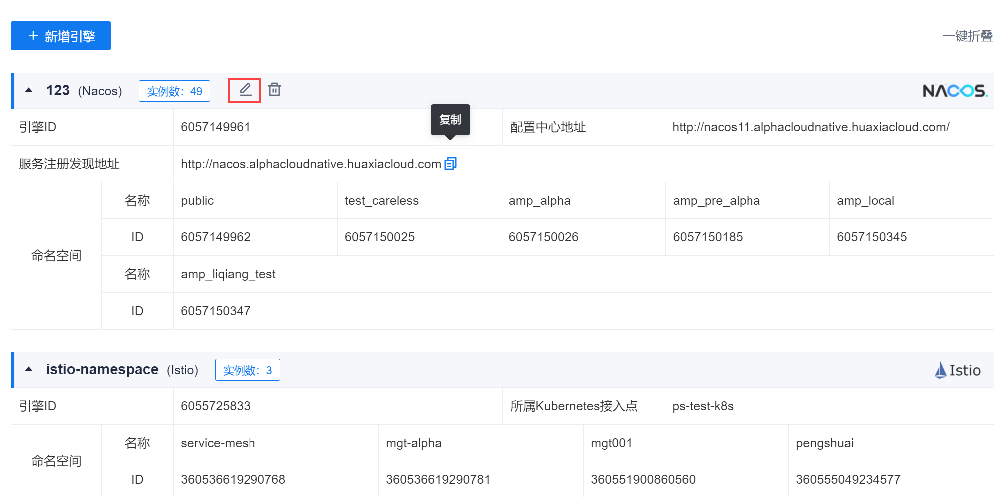
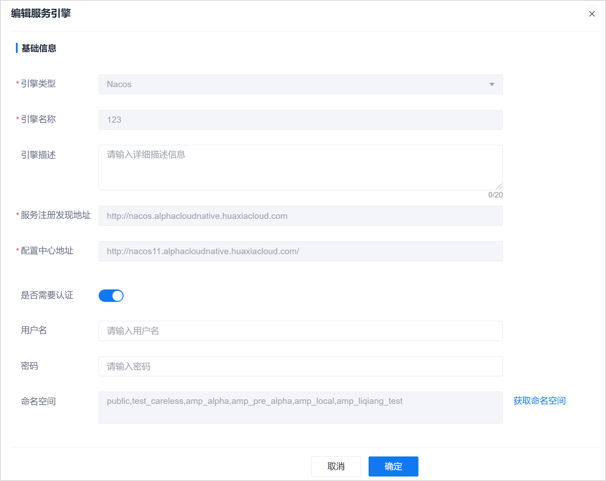

# 修改服务引擎信息

服务引擎创建成功后，只能修改引擎描述和认证信息，其他配置信息不可修改。当引擎中的命名空间发生变化时，您也可以重新获取命名空间。

### 前提条件
* 已使用具有项目“服务引擎管理&服务网关 > 编辑引擎”权限的账号登录系统。

### 操作步骤
1. 在引擎管理页面中，鼠标移动到引擎上，单击引擎名称栏上的。            
                 
2. 在“编辑服务引擎”页面中，修改信息，单击“确定”。
  * 修改“引擎描述”。
  * 对于Eureka、Nacos引擎，可以修改认证信息。
  * 对于Istio、Nacos引擎，单击“获取命名空间”，可重新获取命名空间。
  

