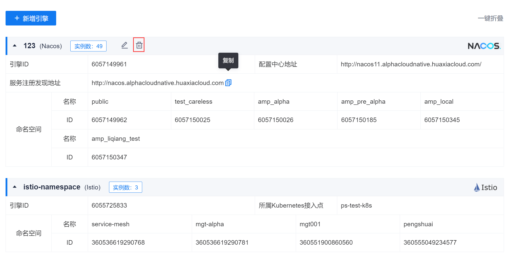
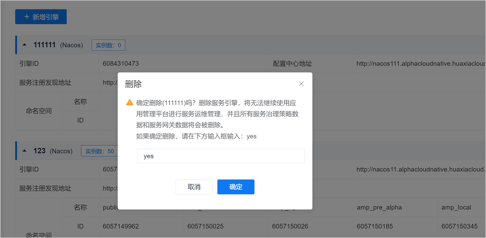

# 删除服务引擎

服务引擎添加成功后，如果引擎的信息发生变化，或者不需要治理该引擎下的服务，您可以删除服务引擎。

### 前提条件
* 已使用具有项目“服务引擎管理&服务网关 > 删除引擎”权限的账号登录系统。

### 操作步骤
1. 在引擎管理页面中，鼠标移动到引擎上，单击引擎名称栏上的。            
                 
2. 在删除服务引擎页面中，输入“yes”，单击“确定”。
  

