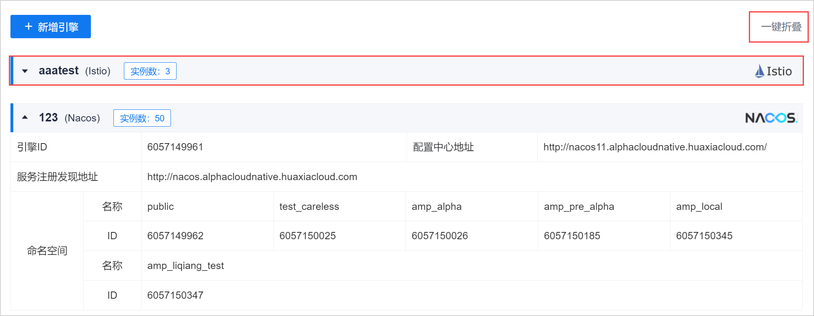
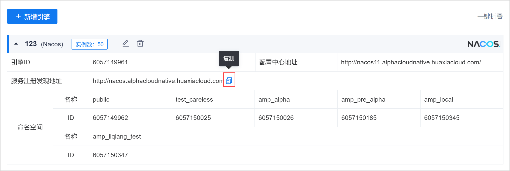

# 查看并拷贝服务引擎的信息

### 查看服务引擎的信息          
在服务引擎管理页面中，可以查看服务引擎的名称、包含的实例数、引擎ID、引擎对接信息、以及命名空间信息。                   
单击引擎标题栏，可以展开/折叠引擎的信息。您也可以单击右上角的一键折叠，折叠所有引擎的信息。            

### 拷贝服务引擎的信息                       
服务引擎的信息可能在其他地方需要用到。您可以在服务引擎管理页面中拷贝相应的信息。        

<table>
<tr>
    <th>引擎类型</th>
    <th>可拷贝的信息</th>
</tr>
<tr>
    <td rowspan="4">Eureka、Nacos</td>
    <td>引擎ID</td>
</tr>
<tr>
    <td>配置中心地址</td>
</tr>
<tr>
    <td>服务注册发现地址</td>
</tr>
<tr>
    <td>命名空间ID</td>
</tr>
<tr>
    <td rowspan="3">Istio</td>
    <td>引擎ID</td>
</tr>
<tr>
    <td>所属Kubernetes接入点</td>
</tr>
<tr>
    <td>命名空间ID</td>
</tr>
</table>

在拷贝时，将鼠标移动到信息上，单击。                    

