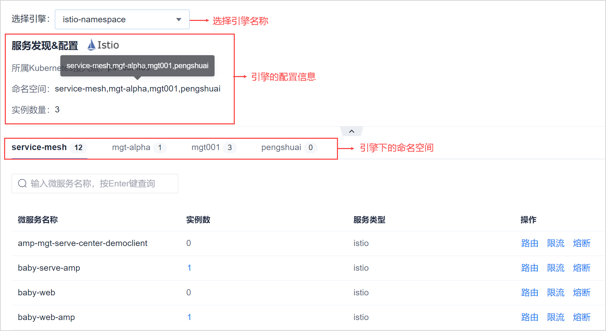
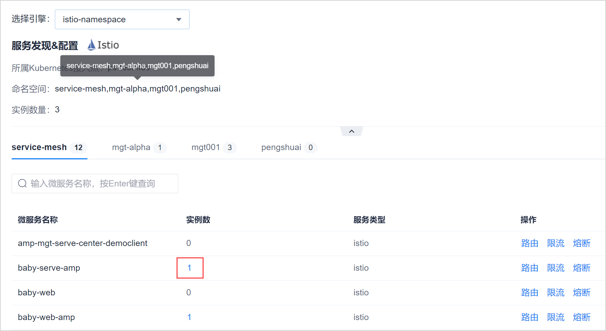

# 管理服务

系统当前版本支持查看服务详情、查看服务中的实例详情。

### 查看服务详情
1. 在项目顶部菜单栏中，单击“应用管理”。
2. 在应用管理左侧导航栏中，单击“微服务引擎 > 服务发现与治理”。             
  右侧页面显示服务列表。           
                 
3. 单击左上角“选择引擎”下拉菜单，选择需要查看服务详情的引擎。
4. 单击命名空间页签，选择需要查看服务详情的命名空间。
  服务列表显示该引擎、该命名空间下的服务名称、包含的实例数、服务类型等信息。

### 查看实例详情
1. 在服务列表页面中，当“实例数”不为0时，单击实例数量。      
                 
系统显示实例列表页面，显示每个实例的信息，包含实例的IP地址、状态、协议类型、端口号和注册时间。
               
