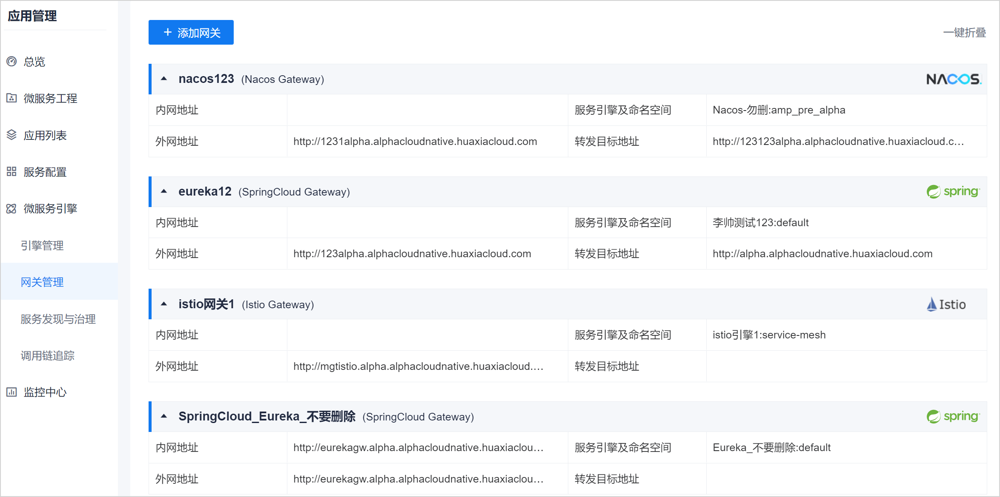
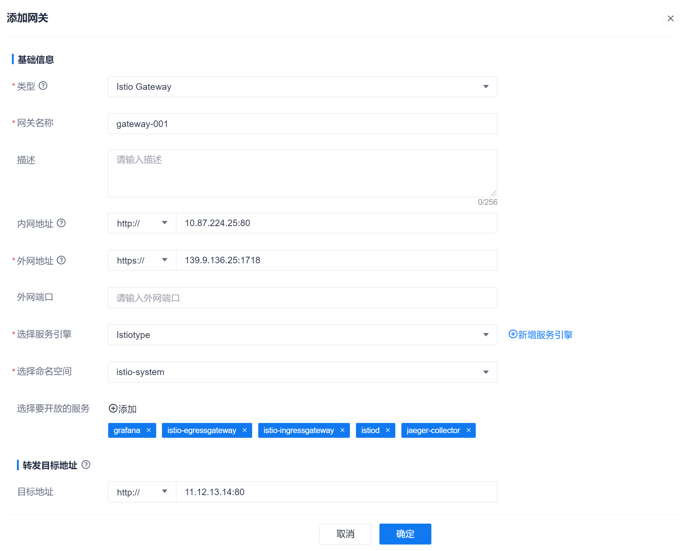

# 添加治理网关

完成治理网关的部署和配置后，您还需要在系统中添加治理网关，并配置与服务引擎和命名空间的映射关系，实现规则的下发和访问请求的转发。

### 前提条件    
* 已使用具有项目“服务引擎管理&服务网关 > 添加网关”的账号登录系统。
* 已完成治理网关的部署和配置。
* 已添加服务引擎。

### 操作步骤
1. 在应用管理左侧导航栏中，单击“网关管理”。      
  右侧页面显示网关管理页面，显示已配置的治理网关列表。    
                 
2. 在治理网关列表页面左上方，单击“添加网关”。
3. 在“添加网关”页面中，根据下表的描述，设置参数，单击“确定”。       
                         
  <table>
<tr>
   <th>参数名称</th>
    <th>说明</th>
</tr>
<tr>
    <td>类型</td>
    <td>根据实际微服务使用的引擎类型选择。取值包括：Istio Gateway、Spring Cloud、Nacos。其中，Spring Cloud对应Eureka服务引擎。</td>
</tr>
<tr>
    <td>网关名称</td>
    <td>自定义治理网关名称，支持中文、数字、字母、_、-，且不能以数字开头，不超过50个字符。</td>
</tr>
<tr>
    <td>描述</td>
    <td>自定义对治理网关的描述信息，不超过256个字符。</td>
</tr>
<tr>
    <td>内网地址</td>
    <td>根据实际情况填写治理网关对服务侧访问地址，可以为域名或IP地址，如果包含端口号，请一并填上端口号。</td>
</tr>
<tr>
    <td>外网地址</td>
    <td>根据实际情况填写治理网关对CAP系统的访问地址，可以为域名或IP地址，如果包含端口号，请一并填上端口号。</td>
</tr>
<tr>
    <td>外网端口</td>
    <td>根据实际情况填写治理网关对CAP系统的访问端口。</td>
</tr>
<tr>
    <td>选择服务引擎</td>
    <td>根据实际情况选择治理网关对应的服务引擎。如果对应的服务引擎还未配置，可以单击后面的“新增服务引擎”，配置引擎。</td>
</tr>
<tr>
    <td>选择要开放的服务</td>
    <td>选择服务引擎后，本参数有效。单击“添加”，然后根据实际情况，选择引擎中要对外开放的服务。如果不选择服务，表示对外开放所有服务。
未开放的服务无法配置治理规则。即无法配置路由规则，也就是说访问请求无法到达未开放的服务。
</td>
</tr>
<tr>
    <td>转发目标地址</td>
    <td>对于命名空间内有业务网关的情况，需要配置业务网关的地址，表示治理网关将访问请求转发到业务网关，再由网关将访问请求转发给各服务。
如果不配置，表示治理网关将访问请求直接转发给各服务。
</td>
</tr>
</table>

页面返回服务网关列表页面。您可以看到新添加的服务网关。        

