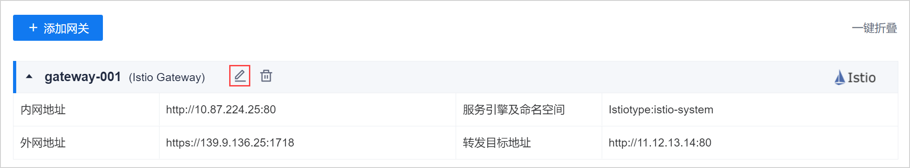

# 修改治理网关信息

治理网关创建成功后，只能修改网关描述，并变更开放的服务，其他配置信息不可修改。

### 前提条件
* 已使用具有项目“服务引擎管理&服务网关 > 编辑网关”权限的账号登录系统。

### 操作步骤
1. 在网关管理页面中，鼠标移动到引擎上，单击网关名称栏上的。            
                 
2. 在“编辑网关”页面中，修改信息，单击“确定”。
  * 修改“描述”。
  * 单击“选择要开放的服务”后面的添加，可变更开放的服务。
  

