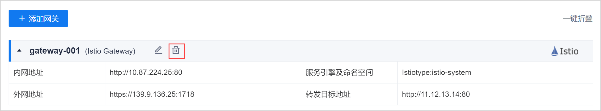

# 删除治理网关

治理网关添加成功后，如果网关的信息发生变化，或者该网关不再使用，您可以删除治理网关。

### 前提条件
* 已使用具有项目“服务引擎管理&服务网关 > 删除网关”权限的账号登录系统。

### 操作步骤
1. 在网关管理页面中，鼠标移动到网关上，单击网关名称栏上的。            
                 
2. 在删除治理网关的确认页面中，单击“确定”。
