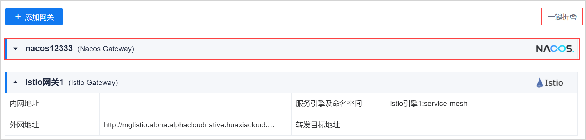
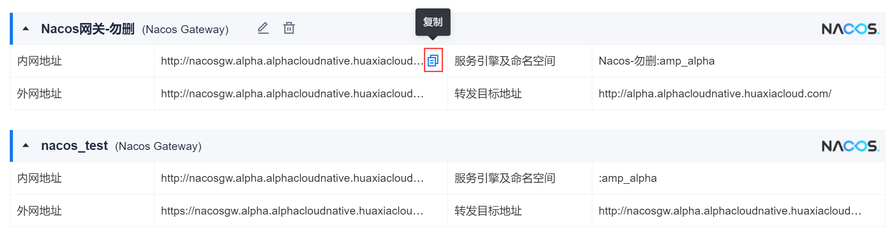

# 查看并拷贝治理网关的信息

### 查看治理网关的信息          
在网关管理页面中，可以查看网关的名称、类型、服务引擎及命名空间、内网地址、外网地址、转发目标地址。                   
单击网关标题栏，可以展开/折叠网关的信息。您也可以单击右上角的一键折叠，折叠所有网关的信息。            

### 拷贝治理网关的信息                       
治理网关的信息可能在其他地方需要用到。您可以在网关管理页面中拷贝相应的信息：
* 内网地址
* 外网地址
* 服务引擎及命名空间
* 转发目标地址       

在拷贝时，将鼠标移动到信息上，单击。                    

