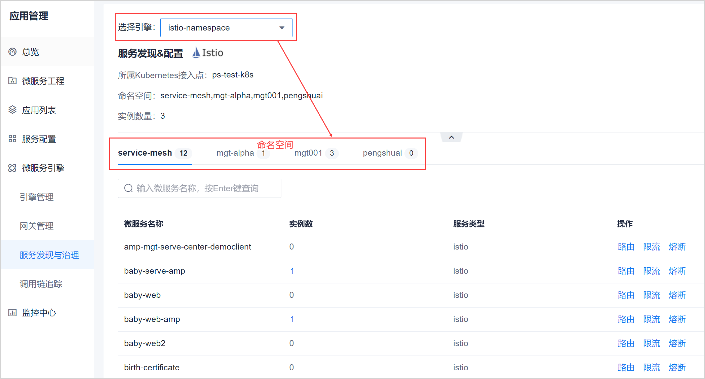

# 设置路由规则
设置路由规则即设置服务的路由访问策略，包括路由路径、负载均衡策略、请求超时时间和失败重试机制。

### 前提条件     
* 已使用具有项目服务列表路由规则相关权限的账号登录系统。
* 已配置服务引擎，且服务已启动。
* 服务已关联网关。

### 背景信息
URL地址的一般组成及说明如下表所示。
{协议}://{域名或IP地址}:{端口}{/虚拟目录/}{文件名}{参数}
例如：       
             

|参数|是否必须|说明|
|:--------- |:----------|:-------- |
|协议|是|表示使用的协议，一般为HTTP、HTTPS。协议后使用“://”分隔。|
|域名或IP地址 |是|服务域名或IP地址。|
|端口|否|与域名之间用“:”分隔。|
|虚拟目录|否|从域名后的第一个“/”开始到最后一个“/”为止，是虚拟目录部分。|
|文件名|否|从域名后的最后一个“/”开始到“？”或“#”为止或到结束，是文件名部分。|
|参数|否|从“？”开始到“#”为止之间的部分为参数部分。URL允许有多个参数，参数与参数之间用“&”作为分隔符。|

### 操作步骤    

1. 在项目顶部菜单栏中，单击“应用管理”。
2. 在应用管理的左侧导航栏中，单击“微服务引擎 > 服务发现与治理”。      
  右侧显示对应引擎下的服务列表。      
             
3. 在右侧页面的上方选择引擎，然后再选择命名空间页签。
4. 在下方单击对应服务“操作”列的“路由”。      
  显示该服务下的路由规则列表。       
             
5. 单击“添加规则”。
6. 在弹出的“添加路由规则”对话框中，根据下表的描述，填写规则信息，单击“确定”。   
             
  
  <table>
<tr>
    <th>参数名称</th>
    <th>说明</th>
</tr>
<tr>
    <td>规则名称</td>
    <td>自定义规则的名称，不超过15个字符，不能包含字符：,、.、/、;、'、[、]、<、>、?、:、"、{、}、|。</td>
</tr>
<tr>
    <td>规则描述</td>
    <td>对规则的描述信息，不超过20个字符。</td>
</tr>
<tr>
    <td>路由路径</td>
    <td>表示允许访问本服务的URL中的“虚拟目录”部分。可以填写完整路径（例如
“/sunhuiliang85/article”），也可以填写一部分，其余部分用“*”代替（例如“/sunhuiliang85/*”）。</td>
</tr><tr>
    <td>负载均衡策略</td>
    <td><ul><li>随机：将访问随机分配给Pod。</li><li>最少请求：将访问分配给最少请求的Pod。</li></ul></td>
</tr>
<tr>
    <td>请求超时时间</td>
    <td>表示超过此时间未响应，表示请求超时。</td>
</tr>
<tr>
    <td>失败重试机制</td>
    <td>置于ON，表示启用机制，允许重试；置于OFF，表示不启用机制，不允许重试。</td>
</tr>
<tr>
    <td>重试次数</td>
    <td>表示允许重试的最大次数。</td>
</tr>
<tr>
    <td>重试超时时间</td>
    <td>表示超过此时间未响应，表示本次重试超时。</td>
</tr>
<tr>
    <td>是否开启规则</td>
    <td>启用规则后，所有对本服务的访问将遵循此规则。</td>
</tr>
</table>

返回路由规则列表页面，显示新添加的路由规则。您可以打开/关闭规则，也可以修改、删除规则。

