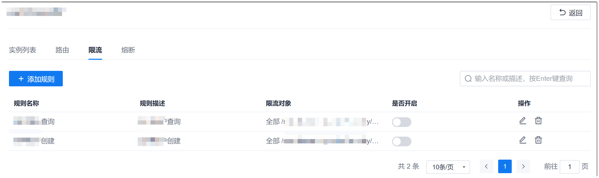
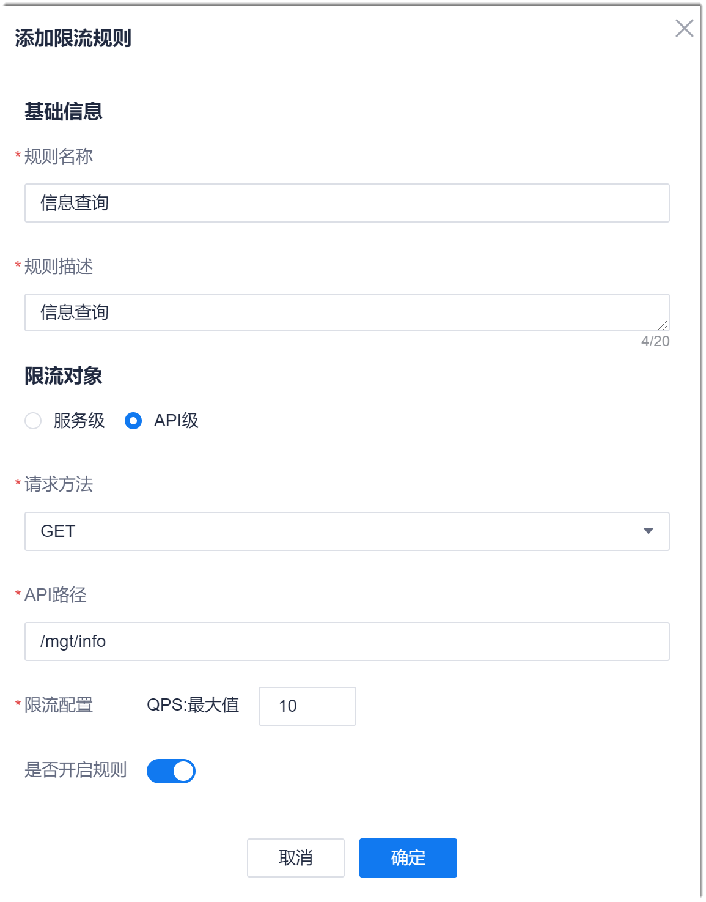

# 设置限流规则
您可以设置限制整个服务的访问流量，也可以限制某个服务中某个API的访问流量。

### 前提条件     
* 已使用具有项目服务列表限流规则相关权限的账号登录系统。
* 已配置服务引擎，且服务已启动。
* 服务已关联网关。

### 操作步骤   
1. 在服务列表页面中，单击操作列的“限流”，或者在服务详情页面中单击“限流”页签。     
   显示该服务下的限流规则列表。     
          
2. 单击左上方的“添加规则”。
3. 在弹出的“添加限流规则”对话框中，根据下表的描述，填写规则信息，单击“确定”。   
         

  <table>
<tr>
    <th>参数名称</th>
    <th>说明</th>
</tr>
<tr>
    <td>规则名称</td>
    <td>自定义规则的名称，不超过15个字符，不能包含字符：,、.、/、;、'、[、]、<、>、?、:、"、{、}、|。</td>
</tr>
<tr>
    <td>规则描述</td>
    <td>对规则的描述信息，不超过20个字符。</td>
</tr>
<tr>
    <td>限流对象</td>
    <td>服务级：对整个服务进行限流；API：对指定API进行限流。</td>
</tr><tr>
    <td>请求方法</td>
    <td>限流对象为API时，显示此参数。限流的API请求命令。</td>
</tr>
<tr>
    <td>API路径</td>
    <td>限流对象为API时，显示此参数。指定限流的API。路径为访问API时的“虚拟目录”路径。</td>
</tr>
<tr>
    <td>限流配置</td>
    <td>设置允许的最大QPS（每秒请求数）。</td>
</tr>
<tr>
    <td>是否开启规则</td>
    <td>启用规则后，所有对本服务的请求将遵循此规则。</td>
</tr>
</table>

返回限流规则列表界面，显示新添加的限流规则。您可以打开/关闭规则，也可以修改、删除规则。

