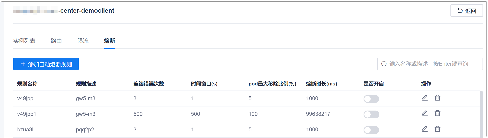
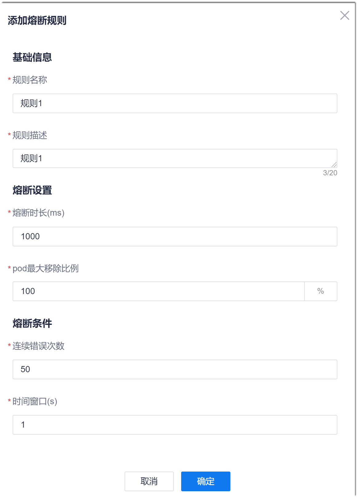
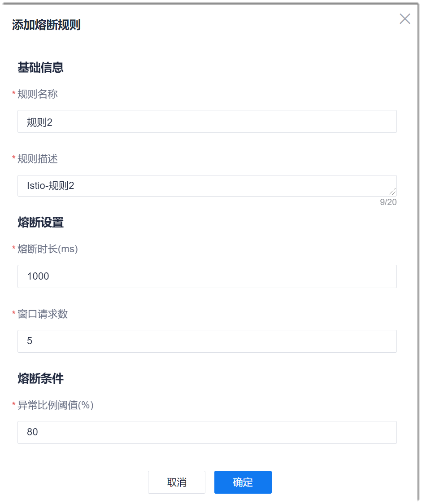

# 设置熔断规则
启用熔断规则后，当达到熔断触发条件时，服务将会按照设置的规则对服务进行熔断。

### 前提条件     
* 已使用具有项目服务列表熔断规则相关权限的账号登录系统。
* 已配置服务引擎，且服务已启动。
* 服务已关联网关。

### 操作步骤     
1. 在服务列表页面中，单击操作列的“熔断”，或者在服务详情页面中单击“熔断”页签。       
   显示该服务下的熔断规则列表。     
          
2. 单击左上方的“添加自动熔断规则”。
3. 配置熔断规则。
  * 配置Istio框架服务的熔断规则：        
      在弹出的“添加熔断规则”对话框中，根据下表的描述，填写规则信息，单击“确定”。       
      
      <table>
<tr>
    <th>参数名称</th>
    <th>说明</th>
</tr>
<tr>
    <td>规则名称</td>
    <td>自定义规则的名称，不超过15个字符，不能包含字符：,、.、/、;、'、[、]、<、>、?、:、"、{、}、|。</td>
</tr>
<tr>
    <td>规则描述</td>
    <td>对规则的描述信息，不超过20个字符。</td>
</tr>
<tr>
    <td>熔断时长</td>
    <td>表示满足规则条件时，熔断多长时间。</td>
</tr><tr>
    <td>pod最大移除比例</td>
    <td>表示熔断时，最多移除多少Pod。</td>
</tr>
<tr>
    <td>熔断条件</td>
    <td>表示在“时间窗口”内，达到请求“连续错误次数”，则满足熔断条件，触发熔断。</td>
</tr>
</table>

  * 配置Spring Cloud、Nacos框架服务的熔断规则：    
     在弹出的“添加熔断规则”对话框中，根据下表的描述，填写规则信息，单击“确定”。       
      
      <table>
<tr>
    <th>参数名称</th>
    <th>说明</th>
</tr>
<tr>
    <td>规则名称</td>
    <td>自定义规则的名称，不超过15个字符，不能包含字符：,、.、/、;、'、[、]、<、>、?、:、"、{、}、|。</td>
</tr>
<tr>
    <td>规则描述</td>
    <td>对规则的描述信息，不超过20个字符。</td>
</tr>
<tr>
    <td>熔断时长</td>
    <td>表示满足规则条件时，熔断多长时间。</td>
</tr><tr>
    <td>熔断条件</td>
    <td>表示服务的请求数达到“窗口请求数”，且异常请求的比例达到“异常比例阈值”时，则满足熔断条件，触发熔断。</td>
</tr>
</table>

返回熔断规则列表界面，显示新添加的熔断规则。您可以打开/关闭规则，也可以修改、删除规则。

