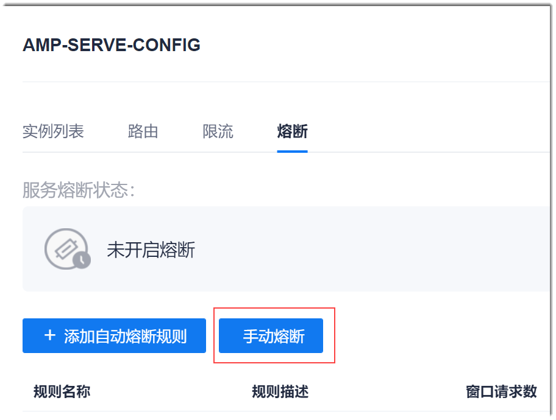
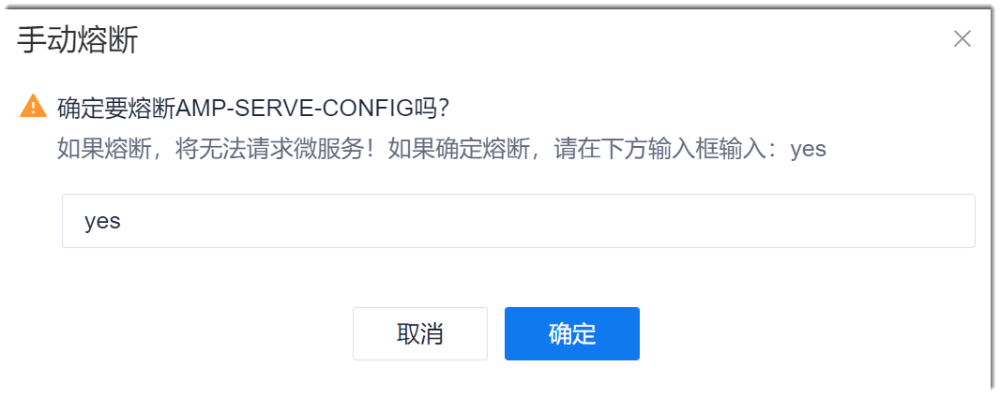
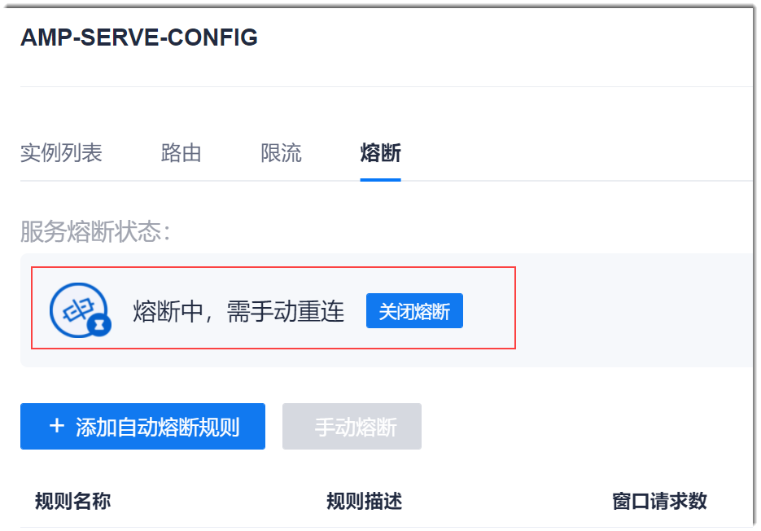
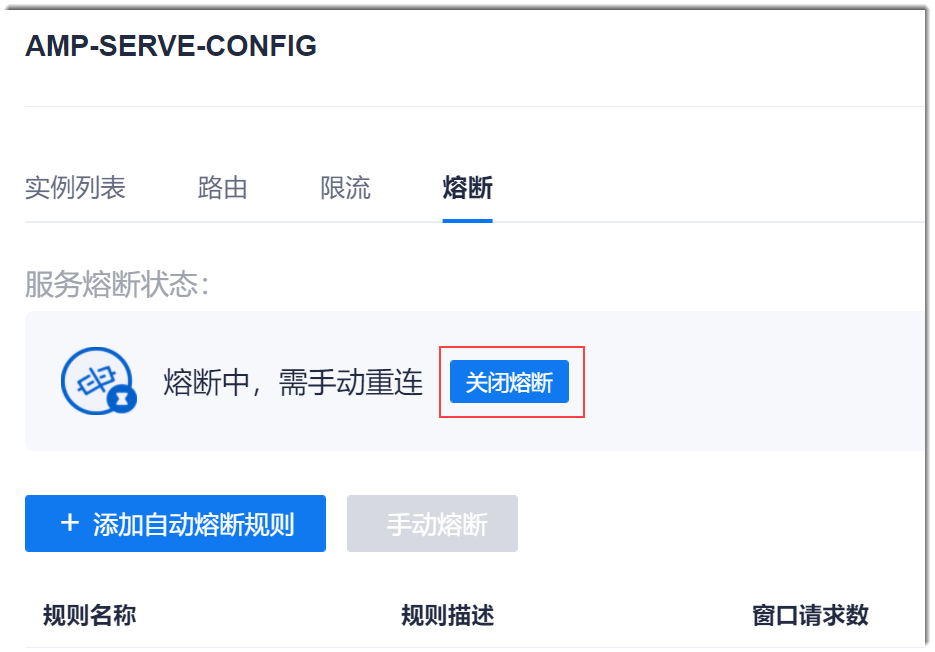

# 手动熔断服务

对于Eureka和Nacos框架的服务，您也可以手动熔断和关闭熔断。

### 前提条件
* 已使用具有项目服务列表“手动熔断”权限的账号登录系统。
* 已配置服务引擎，且服务已启动。
* 服务已关联网关。

### 熔断服务
1. 在Eureka或Nacos框架服务列表页面中，单击操作列的“熔断”，或者在服务详情页面中单击“熔断”页签。       
2. 在熔断页面中，单击“手动熔断”。          
             
3. 在弹出的确认对话框中，输入“yes”，单击“确定”。           
           
系统返回熔断规则列表。列表上方显示熔断状态。             
          

### 关闭熔断          
关闭熔断后，服务恢复正常。       
当服务开启熔断后，在熔断页面中，单击“关闭熔断”。      
         
