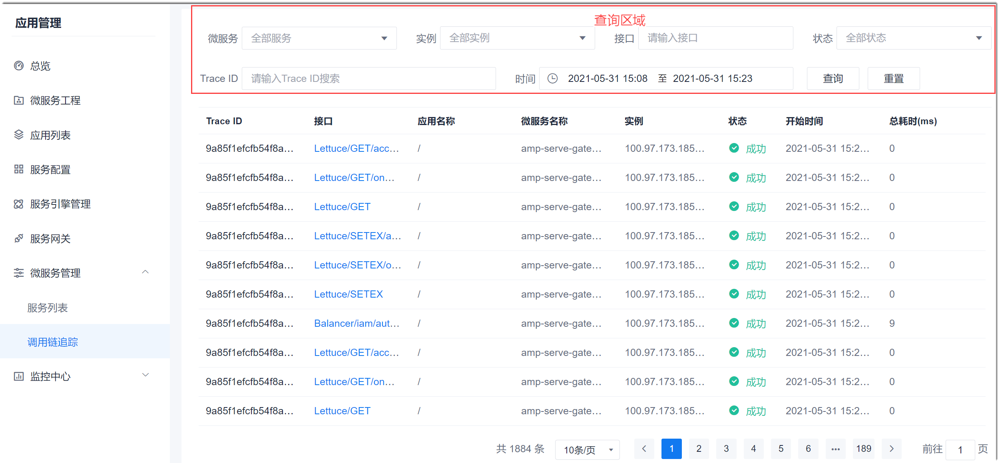
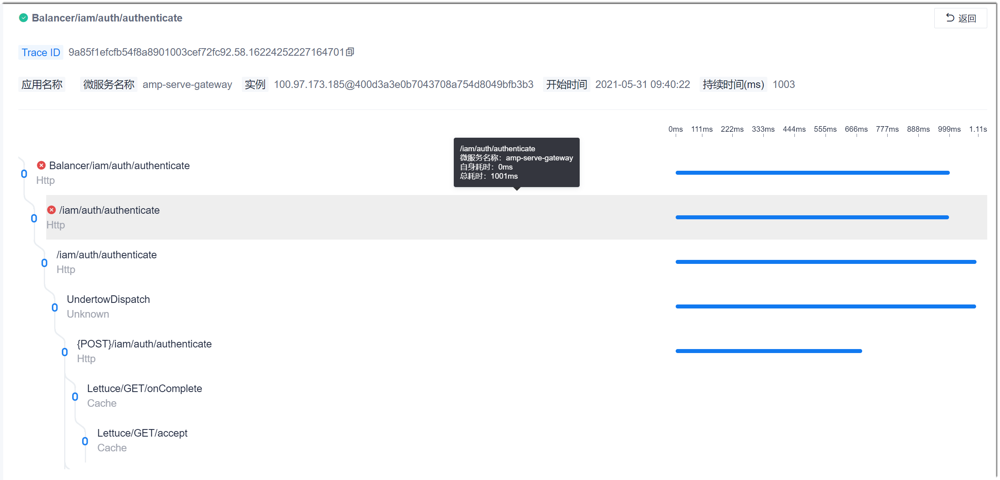

# 查看调用链

调用链是指服务被请求后，经过的路径。您可以查看服务接收到请求后，经过的路径，以及每个路径点的调用结果和响应时，从而定位调用链是否正常。

### 前提条件
* 已配置服务引擎，且服务已启动。
* 在查看时间段内，至少有一次服务请求，才能看到调用链数据。

### 操作步骤
1. 在项目顶部菜单栏中，单击“应用管理”。
2. 在应用管理的左侧导航栏中，单击“微服务管理 > 调用链追踪”。              
  系统默认显示所有服务的调用情况。您可以在上方查询区域中设置查询条件，精确查找需要的调用请求。        
               
3. 单击调用请求的接口，可以查看调用详情。       
  鼠标放到调用节点上，可以查看该节点的信息。节点下有多条同级的线条，表示该节点之后同时调用了多个节点。
    

   

