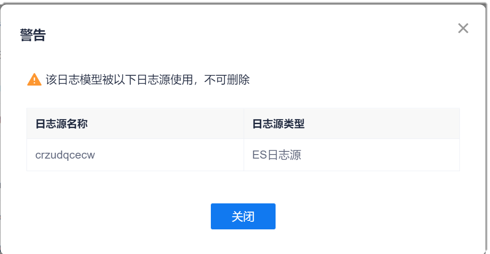
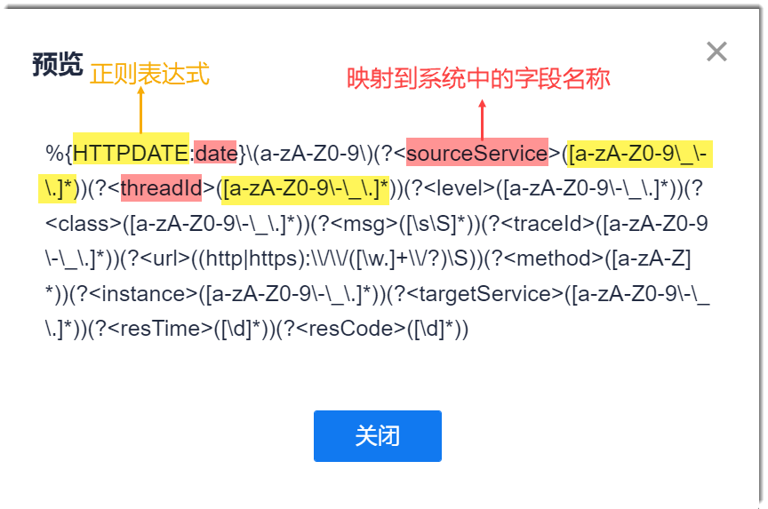

# 修改/删除/复制/预览日志模型

已被日志源使用的日志模型不能被修改和删除。如果需要修改或删除已被使用的日志模型，请先取消日志源对该日志模型的使用。

### 修改日志模型
1. 在项目顶部菜单栏中，单击“应用管理 > 监控中心 > 日志模型管理”。
2. 单击日志模型后面的。      
  如果日志模型已被日志源使用，将弹出提示框，提示不能被编辑，以及被哪个日志源使用。如果确实需要修改日志模型，请先在日志源中解除对该日志模型的使用，然后再修改。      
                
  如果日志模型未被日志源使用，则显示“编辑日志模型”页面。  
3. 在“编辑日志模型”页面中，修改相关内容，单击“确定”。

### 删除日志模型
1. 在项目顶部菜单栏中，单击“应用管理 > 监控中心 > 日志模型管理”。
2. 单击日志模型后面的。    
  如果日志模型已被日志源使用，将弹出提示框，提示不能被删除，以及被哪个日志源使用。如果确实需要删除日志模型，请先在日志源中解除对该日志模型的使用，然后再删除。      
                
  如果日志模型未被日志源使用，则显示确认提示框。  
3. 在删除确认提示框中，单击“确定”。

### 复制日志模型
1. 在项目顶部菜单栏中，单击“应用管理 > 监控中心 > 日志模型管理”。
2. 单击日志模型后面的。   
3. 在“复制日志模型”对话框中，输入日志模型的名称和备注，单击“确定”。

日志模型复制成功后，系统返回日志模型列表页面，显示刚刚复制的日志模型。您可以单击，修改日志模型的内容。

### 预览日志模型
1. 在项目顶部菜单栏中，单击“应用管理 > 监控中心 > 日志模型管理”。
2. 单击日志模型后面的。     
  系统显示“查看日志模型”页面。您可以查看日志模型的详细信息，并且在规则列表上方单击“预览”，查看规则详情。       
  红色底色的内容表示该段内容映射到系统中的字段名称。自定义规则的内容不会映射到系统字段。黄色底色的内容表示该段内容的正则表达式。        
                
     
