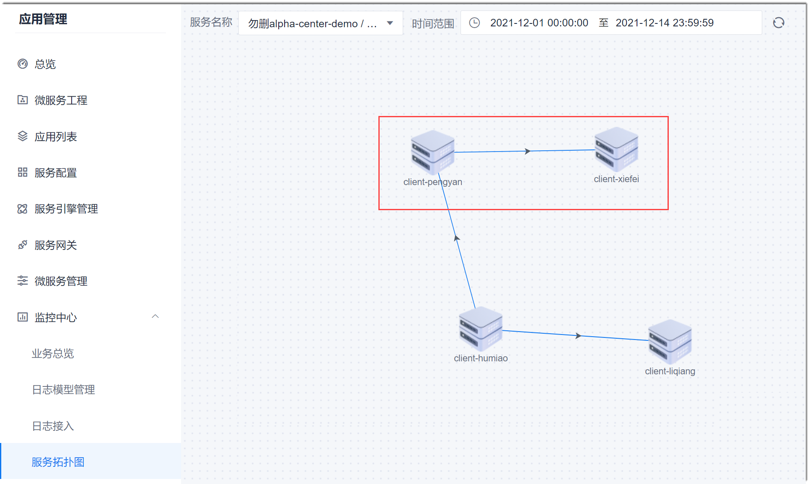

# 查看服务拓扑图

通过服务拓扑图，您可以查看日志源下面所有的服务以及服务之间的调用关系；也可以查看与某个服务存在调用关系的服务。                 

### 前提条件
* 已添加日志源，且日志源中有相应的数据。

### 操作步骤
1. 在项目顶部菜单栏中，单击“应用管理 > 监控中心 > 服务拓扑图”。           
  右侧页面默认显示第一个日志源、当天包含的服务，以及服务之间的调用关系。      
2. 在右侧页面上方，在“服务名称”中，选择需要查看的日志源或者服务（可以选到日志源，也可以选到日志源下面的某个服务），选择日志的时间范围，单击“确定”。                         
  如果选择日志源，则拓扑图显示该日志源下包含的所有服务，以及服务之间的调用关系。          
  如果选择服务，则拓扑图显示与该服务存在调用关系的服务，以及服务之间的调用关系。         
  例如，图中红框所示，表示：服务“client-pengyan”调用了服务“client-xiefei”。       
        

