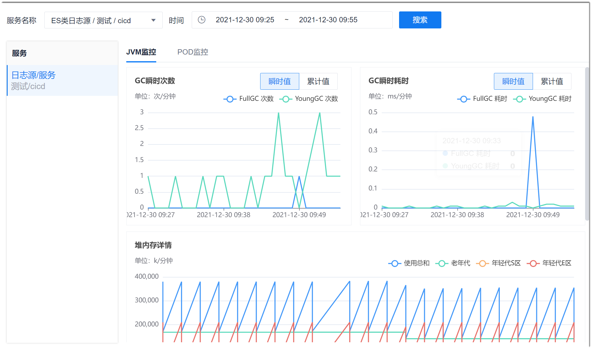

# 监控运行环境

监控运行环境可以监控服务或者服务中实例的JVM环境或者POD环境。        
JVM是指Java Virtual Machine（Java虚拟机）的缩写。JVM是一种用于计算设备的规范，它是一个虚构出来的计算机是通过在实际的计算机上仿真模拟各种计算机功能来实现的。         

在JVM监控中，您可以查看GC（Garbage Collection，垃圾收集）次数、GC耗时、堆内存情况和元空间情况。

### 前提条件
* 已添加日志源，且日志源中有相应的数据。

### 操作步骤
1. 在项目顶部菜单栏中，单击“应用管理 > 监控中心 > 运行环境监控”。          
  右侧页面默认显示第一个日志源下的第一个服务第一个实例（如果服务下没有实例，则直接显示服务）、当天的JVM环境情况。       
2. 在右侧页面中依次执行：
  1. 在页面上方选择服务，选择要查看的时间段（最多只能选择8天），单击“确定”，然后单击“搜索”。
  2. 在“实例”或“服务”区域中，单击需要查看的实例。          
      如果服务中包含实例，则显示“实例”区域，区域中显示实例名称。单击实例名称，右侧页面显示该实例的运行环境情况；如果服务中没有实例，则显示“服务”区域，区域中显示服务名称，右侧页面显示服务的运行环境情况。
  3. 选择“JVM监控”或者“POD监控”页签。
            
 
   其中：
  * **瞬时值**表示统计项在1分钟内的求和数值。            
  * **累计值**表示统计项在服务/实例启动到统计时刻的求和数值。

  

