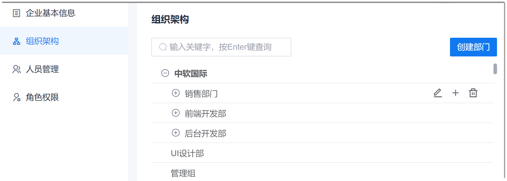

# 迁移组织架构

迁移组织架构即在CAP中创建原系统中的各级部门。

### 前提条件
* 已使用超级管理员或管理员角色的账号登录系统。

### 背景信息
同级部门之间按照部门最后修改时间正序排序（即创建时间最早的排最前面）。               
当部门下面有子部门时，部门前面的图标显示为。单击图标，可展开部门，查看子部门。当部门下面没有子部门时，部门前面无图标。

### 创建部门
1. 在系统任意界面，单击左上角的“ > 企业管理”。
2. 在左侧导航栏中，单击“组织架构”。                      
  右侧界面显示一级部门列表。              
                 
3. 创建一级部门。
  1. 在组织结构列表右上方，单击“创建部门”。
  2. 在弹出的“新建部门”对话框中，输入部门名称，单击“确定”。                      
                           
4. 创建子部门。
  1. 鼠标移动到父部门上，单击右侧的。               
                      
  2. 在弹出的“新建子部门”对话框中，输入部门名称，单击“确定”。                       
    

