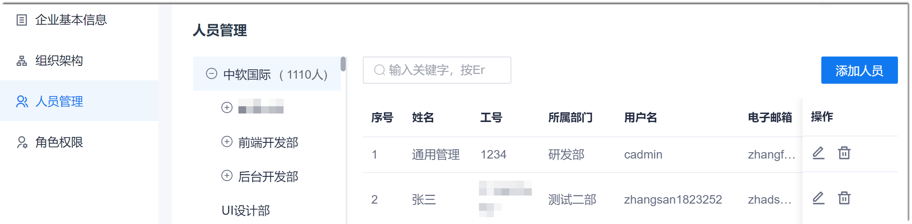
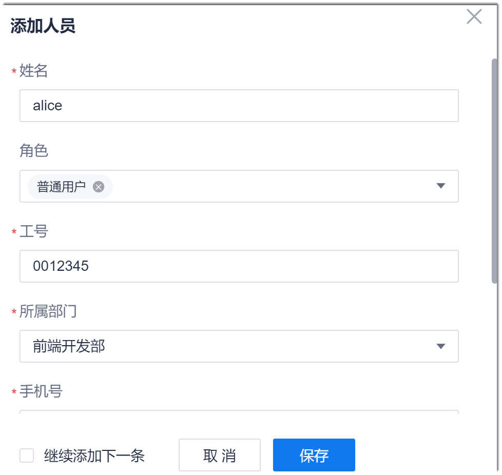
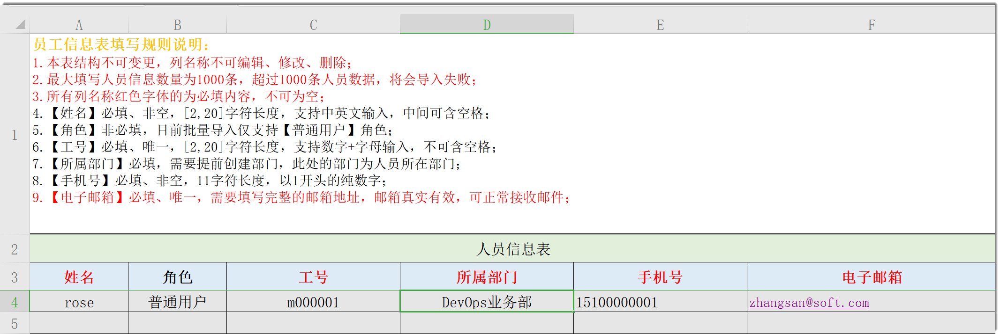

# 迁移企业成员

建议在CAP中通过导入的方式迁移企业成员，提升迁移效率。

如果原系统可以将成员信息导出，建议先将原系统中的成员信息导出，然后使用CAP的企业成员导入模板，编辑成员信息，再导入到CAP中。

人员添加（包括添加单个人员和批量导入人员）后，需要激活账号，账号才能正常使用。

### 添加人员
1. 在系统任意界面，单击左上角的“ > 企业管理”。
2. 在左侧导航栏中，单击“人员管理”。                            
     右侧主界面显示组织架构和企业人员。企业人员按人员最后被编辑的时间由近到远的顺序显示。                        
                          
3. 在界面右上方，单击“添加人员”。
4. 在弹出的“添加人员”对话框中，按实际情况填写人员信息，单击“保存”。                           
  
> [!NOTE]
> 如果需要添加多个人员，可以勾选对话框左下角的“继续添加下一条”。勾选并单击“保存”后，继续弹出“添加人员”对话框。
     

|参数名称      |填写规则|
| :---------    | :-------- |
|姓名    |2~6个中文字符，企业内唯一。 |
|角色|在下拉框中选择。如果不选择，默认为“普通用户”角色。|
|工号    |2~20个字母和数字组合，企业内唯一。 |
|所属部门    |选择已配置的组织部门。|
|手机号      |11位数字组合，必须以“1”开头，第二位必须为3~9。|
|电子邮箱    |符合邮箱地址规则。|
|用户名      |系统自动生成。生成规则：“姓名”的拼音+“手机号”后四位。例如，“姓名”为“李三”，“手机号”后4位为“1234”，则“用户名”为“lisan1234”。|

企业人员管理主页面显示刚刚添加的人员。         
人员添加成功后 ，默认状态为“未激活”状态。此时，人员不能使用账号登录。您需要[激活人员](#激活人员)后，人员才能使用账号登录系统。

### 导入人员
1. 在企业人员管理界面中，单击右上方的“批量导入”。      
  
2. 在“模板下载”页签中，单击“下载人员批量导入模板”，下载模板。     
  
3. 在本地打开模板，按照格式要求填写数据（不能修改数据单元格之外的内容）。填写完成后，保存并关闭文件。    
  
4. 返回企业人员管理的“模板下载”页签中，上传文件，单击“下一步”。
5. 在“批量导入”页签中，单击“导入前检查”。在检查通过后，单击“导入”。       
  导入前检查主要检查文件的格式问题。导入时再验证数据。如果某些数据验证不成功，不影响验证成功数据的导入。      
         

导入成功的数据显示在界面中。导入失败的数据和失败原因请单击“历史记录”页签，然后单击下载文件查看。      

### 激活人员
人员添加成功后 ，默认状态为“未激活”状态。此时，人员不能使用账号登录。您需要激活人员后，人员才能使用账号登录系统。
**激活单个人员**
1. 在企业人员列表中，单击“未激活”状态人员操作列的“ > 激活”。          
                         
2. 在弹出的确认对话框中，单击“确定”。

**批量激活人员**
1. 在企业人员列表中，勾选需要激活的人员，然后单击列表上方的“激活”。       
  
2. 在弹出的确认对话框中，单击“确定”。

激活人员后，系统会发送密码设置邮件到人员的预留邮箱中。邮件内容如下图所示。              
                   
企业人员单击邮件中的“here”，设置登录密码。重置密码邮件的有效期为24小时。超过24小时，或在设置密码后，密码设置邮件失效。

