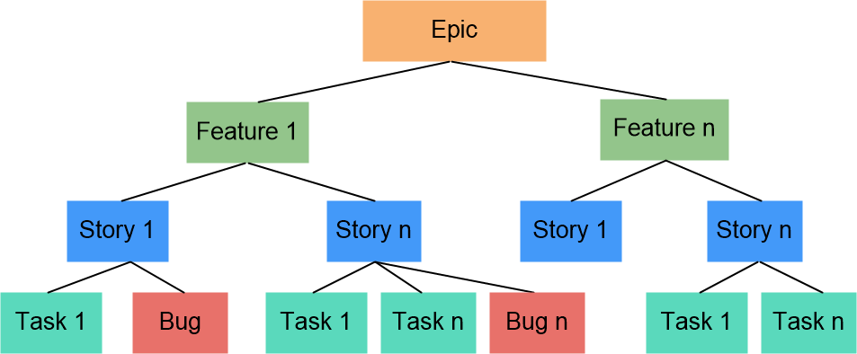

# 迁移工作项

工作项包含需求和缺陷。                        
CAP默认的工作项模板和工作流可能与原系统的内容不一致。此时，您可以分工作项类型，自定义工作项的模板和工作流。

### 工作项模型                  
客户的需求或原始需求，往往是抽象甚至宏观的Epic（通常翻译为史诗）。需要理解客户需求背后的问题本质，来把客户需求或原始需求进行规划和分解，分解为多个Feature（特性），继而再逐步分解为Story（用户故事）。到实际开发时，还需将Story分解为具体的Task（任务）。发现产品的缺陷，还需创建Bug（缺陷），以跟踪缺陷的修改。这些统称为工作项。工作项模型如下图所示。
             

Epic（史诗）、Feature（特性）用于描述较大的系统的行为，而具体的实现工作是通过待办列表（Backlog）中的Story（故事）、Task（任务）来描述的。Story是站在用户视角，符合INVEST原则的最小可交付的工作项单元，旨在提供实现系统行为的一小块功能，以便是在增量开发。根据开发人力和Epic的计划时间，Story的大小推荐在一次迭代中可以完成。
> [!NOTE] 
> INVEST原则：
> + Independent：独立或松耦合，故事可以以任何顺序传递。可通过组合或者分割减少依赖性。
> + Negotiable：可协商，故事的细节由PO、团队和感谢人在澄清和讨论中共同确定。
> + Valuable：有价值，对客户、用户或两者来说，有价值。
> + Estimable：可估算，对于团队来说，可以估算故事的大小，即估算工作量和成本。
> + Small：大小合适，您可以在一个迭代中构建多个故事。
> + Testable：可测试，故事要有相应的优质接收标准，您能够编写测试来验证故事是否能达到满意条件。
  
各级需求的详细描述如下表所示：

| 需求类型   | 说明     |   举例 |
| :--------- | :--- | :------|
| Epic（战略举措）|<ul><li>指公司的关键战略举措，可以是重大的业务方向，也可以是重大的技术演进。</li><li>企业通过对Epic的发现、定义、投资、管理和落地达成，使得企业的战略投资主题得以落地，并获得相应的市场地位和回报。</li><li>Epic的工作量通常以月为单位，需多个迭代才能完成。</li></ul>| Epic通常和公司的经营、竞争力、市场环境紧密相关，举例如下： <ul><li>例1：市场差异化：用户体验全面超越竞争对手。</li><li>例2：更好的解决方案：新增支持工业互联网的解决方案。</li><li>例3：重大技术方向：产品需要全部切换为容器。</li></ul>|
|Feature（特性）|<ul><li>可以给客户带来价值的产品功能或特性。</li><li>相比Epic，Feature更具体形象，代表一个产品可以做什么，或提供什么服务。是可以满足用户的需求，为客户服务，为用户带来真正的价值的成果的特性。 Feature的工作量通常以周为单位，需要多个迭代完成交付。|   特性的描述通常需要说明对客户的价值，与产品的形态、交付模式有关，举例如下： 推荐模板：作为<角色> …，我希望<结果>…，以便于<目的><ul><li>例1：作为一个管理员，我希望提供导入、导出功能，以便于批量整理数据，更高效。</li><li>例2：作为一名开发人员，我希望提供超期邮件的通知，以便于及时处理任务。</li></ul>|
|Story（用户故事）|<ul><li>从用户角度对产品需求的详细描述，更小粒度的功能。</li><li>将Story放入有优先级的backlog中，持续规划、滚动调整优先级，始终让高优先级的Story更早地交付给客户。</li><li>Story的工作流通常以天为单位，并应在一个迭代内完成交付。</li><li>Story的工作量估计可以使用人时、人天，也可以使用敏捷推荐的故事点。</li></ul>|<ul><li>例1：作为项目经理，希望通过过滤处理人，以便于快速查询指定人的需求。</li><li>例2：作为开发人员，希望将无用的信息进行折叠，以便于减少视觉干扰。</li></ul>|
|Task（任务）|Task通常为过程性的工作，通常是迭代计划中每个开发人员做的任务。|<ul><li>例1：开发人员A需要在今天准备好类生产环境。</li><li>例2：开发人员B需要在本周内完成项目组的权限设定。</li></ul>| 
|Bug（缺陷）|产品在测试验证阶段发现的问题，通过Bug单独创建、管理和跟踪，Bug通常包括不同的优先级。|缺陷描述举例：<ul><li>【故障现象】</li><li>【错误码】</li><li>【环境】</li><li>【故障复现步骤】</li><li>【定位开发人员】</li><li>【开发定位初步原因】</li><li>【相关报文】</li></ul>|
