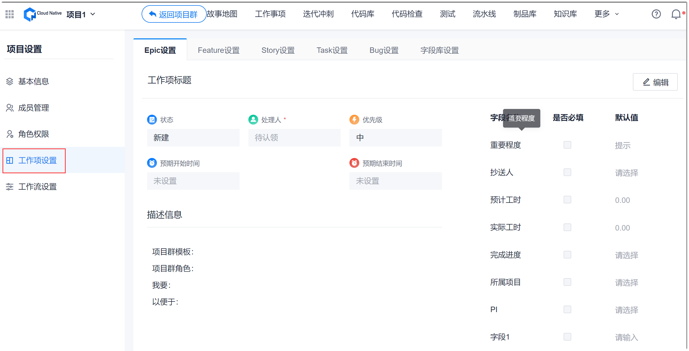
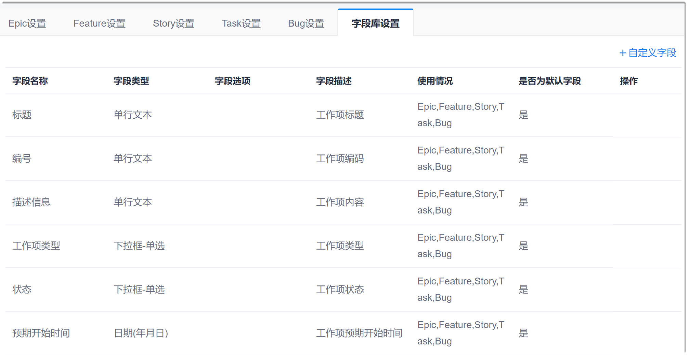
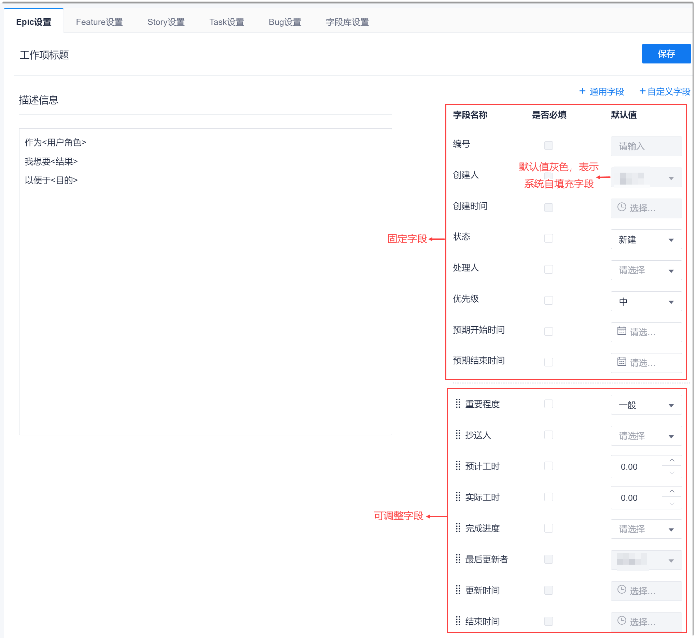

# 自定义工作项模板

在项目内，针对每种类型的工作项，您均可以自定义其包含的字段以及字段的相关信息，以便于灵活适应各种项目的不同需求。

### 背景信息                         
CAP支持字段库，即将适用于多种工作项类型的字段在字段库中统一配置，实现一次配置，多次使用的目的。字段库中的字段称为“通用字段”。          
在字段库中，系统默认的字段不能被删除和修改，只能删除和修改自定义字段。在工作项字段中，系统默认的字段不能被删除，只能删除自定义的字段。       

### 设置通用字段
设置通用字段后，可在定义工作项类型的字段时引用。                     
1. 在项目顶部菜单栏中，单击“项目设置”。
2. 在左侧导航栏中，单击“工作项设置”。                          
     右侧页面显示工作项类型以及通用字段设置页签。                       
                         
3. 在右侧页面中，单击“字段库设置”页签。                      
     下方显示通用字段列表。                          
                      
4. 新增通用字段。                           
  1. 在列表右上方，单击“自定义字段”。
  2. 在“自定义字段”对话框中，设置“字段名称”、“字段类型”和“字段描述”，单击“确定”。                            
                           
    其中，字段类型的说明如下表所示。
    
|字段类型|说明|
|:--------- |:-------- |
|单行文本|最多输入50个字符。|
|多行文本|最多输入200个字符。|
|下拉框-单选|需配置选项，每个选项不超过10个字符。|
|日期(年月日)|以yy-mm-dd格式显示日期。|
|数字|精确到小数点后2位。|
|下拉框-多选|需配置选项，每个选项不超过10个字符。|
|日期(年月日时分秒)|以yy-mm-dd h:m:s格式显示时间。|

新添加成功的字段显示在字段列表最后。

### 设置工作项类型的模板
1. 在工作项设置界面中，单击需要定义模板的工作项类型，例如“Epic设置”。
2. 在界面右上方，单击“编辑”，然后根据实际情况修改内容：
  * 在“描述信息”中，修改工作项描述的模板。
  * 添加字段。
    * 添加通用字段。                  
      在界面右上方，单击“通用字段”。然后在弹出的“通用字段”对话框中，选择字段，单击“确定”。                  
    * 添加自定义字段。                 
      在界面右上方，单击“自定义字段”。然后在弹出的“自定义字段”对话框中，设置“字段名称”、“字段类型”和“字段描述”，单击“确定”。                
  * 设置“是否必填”和“默认值”。
  * 调整字段的显示顺序：在可调整字段区域中，拖拽带图标的字段到需要的位置。             
  * 删除自定义字段：单击自定义字段后面的。               
    
    
> [!NOTE]
> 固定字段不能被调整顺序，系统自填充字段的值为系统填充，不能配置。

3. 设置完成后，单击页面右上方的“保存”。                     

工作项模板设置成功后，已有的工作项和新建的工作项均会根据新模板同步更新。                
其它类型的工作项模板，请参照上述步骤定义。
