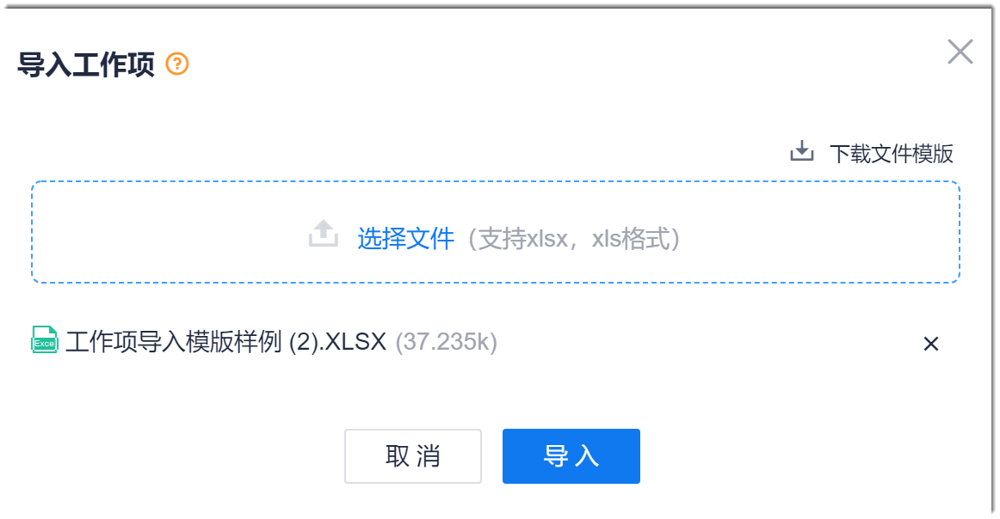

# 迁移工作项

CAP的工作项支持批量导入。建议您从原系统中将工作项导出后，将工作项信息录入到CAP的工作项导入模板中，然后导入系统，完成工作项的迁移。

### 导入工作项
1. 在工作项列表的右上方，单击“ > 导入”。
2. 在“导入工作项”界面中，单击“下载文件模板”。                               
                              
3. 在本地打开工作项导入模板。根据模板第1行的填写规则，从第3行开始填写工作项的信息数据。第2行为字段标题。填写完成后，保存并关闭文件。         
  模板显示的字段为系统的默认字段。如果需要填写自定义字段或者自定义字段已设为必填字段，则需要在默认字段后，手动添加自定义字段的名称，并填写相关内容。红色字体的字段为必填字段，其它字段为非必填字段。                          
> [!NOTE]
> 建立工作项的父子关系时，“原系统父级工作项编码”为导入文件中的父工作项的编码，“父级工作项编码”为当前系统中已有工作项的编码。请区分填写。           
> 在填写工作项信息时，除必填参数外，建议将父级工作项和迭代版本填写完整，便于形成整洁的工作项层级关系，以及将对应的工作项纳入所属的迭代版本计划中。             
 
     
4. 返回系统的“导入工作项”界面，单击“选择文件”，然后选择已填写好的工作项文档，单击“导入”。                        
   
> [!NOTE]
> 如果工作项文档中有填写不规范的地方，在导入时，系统会提示。     

### 在线创建工作项
1. 在项目顶部菜单栏中，单击“工作事项”。
2. 在页面右上角，单击“新建 > _工作项类型_”。
3. 在“新建工作项”页面中，参考下表的描述，填写工作项的相关信息，单击“确定”。
> [!NOTE]
> 工作项的字段支持自定义，因此工作项的界面根据工作项类型不同。以下以默认的“Story”工作项为例。
> 创建工作项时，除必填参数外，建议将“父级工作项”和“迭代版本”填写完整，便于形成整洁的工作项层级关系，以及将对应的工作项纳入所属的迭代版本计划中。

  

  

|参数名称或区域| 必填项 |参数说明
| :--------- | :-------- |:--------|
|工作项标题    |是| 工作项的名称。长度不超过100个任意字符。|
|状态|否 |工作项当前所处的状态，取值范围为系统预置的状态。系统预置的状态如下：<ul><li>Epic/Feature：新建、进行中、已完成。</li><li>User StoryTask/Bug：新建、进行中、已解决、测试中、已拒绝、已关闭。</li></ul>创建工作项时，默认取值为开始状态（新建）。|
|处理人|否|工作项处理的负责人。取值范围为该项目的创建者和成员。创建工作项时，默认取值为工作项创建者。|
|优先级|否  |工作项处理的优先级，从高到低依次为：高、中、低。|
|预计开始时间|否  |计划开始处理工作项的时间。|
|预计结束时间|否 |计划工作项处理结束的时间。|
|工作项描述   |否 |根据实际情况，按照模板要求填写工作项描述。  |
|附件|否 |上传工作项所需的附件。既可以单击添加区域从本地文档上传，也可以将文档拖拽至添加区域上传。 |
|重要程度|否 |工作项的重要程度，从高到低依次为：高、中、低。|
|抄送人| 否  |设置工作项的抄送人后，抄送人可以收到工作项的动态消息。|
|预计工时|否   |估算的工作量，支持“小时”和“人天”两种单位。|
|实际工时| 否  |实际耗费的工作量，支持“小时”和“人天”两种单位。|
|完成进度| 否  |工作项的完成进度，以百分数表示。当工作项下面有子工作项时，本参数不可设置，由子工作项的完成进度汇总平均取整得来。|
|父级工作项| 否 |Epic类型的工作项不支持此参数。设置父级工作项。Feature只能选择Epic，Story只能选择Feature，Task和Bug只能选择Story。|
|迭代版本|否|Story、Task、Bug类工作项支持此参数。设置本工作项规划的迭代。取值范围为配置的迭代。|
|故事点|否|Story类工作项支持此参数。以故事点为单位的工作量估算。取值范围为100以内的斐波那契数列。|
|最后更新者|否|工作项创建后显示此参数。系统自维护字段。表示到目前为止，最后一次更新的操作者。|
|最后更新时间|否|工作项创建后显示此参数。系统自维护字段。表示到目前位置，最后一次更新的时间。|
|结束时间|否|工作项创建后显示此参数。系统自维护字段。表示将工作项设置为结束态的时间。|

系统返回工作项列表页面，您可以在工作项列表中查看新创建的工作项。

