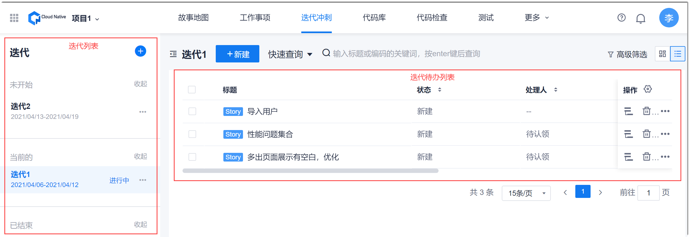
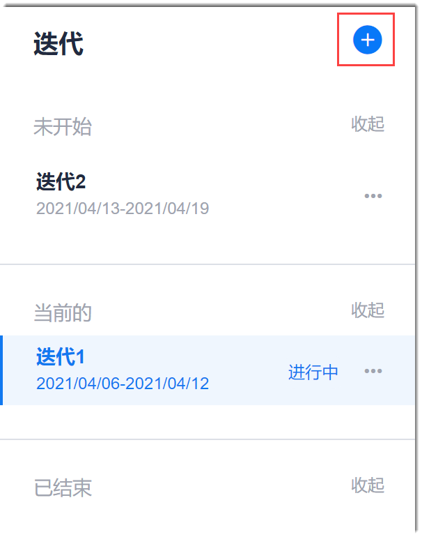
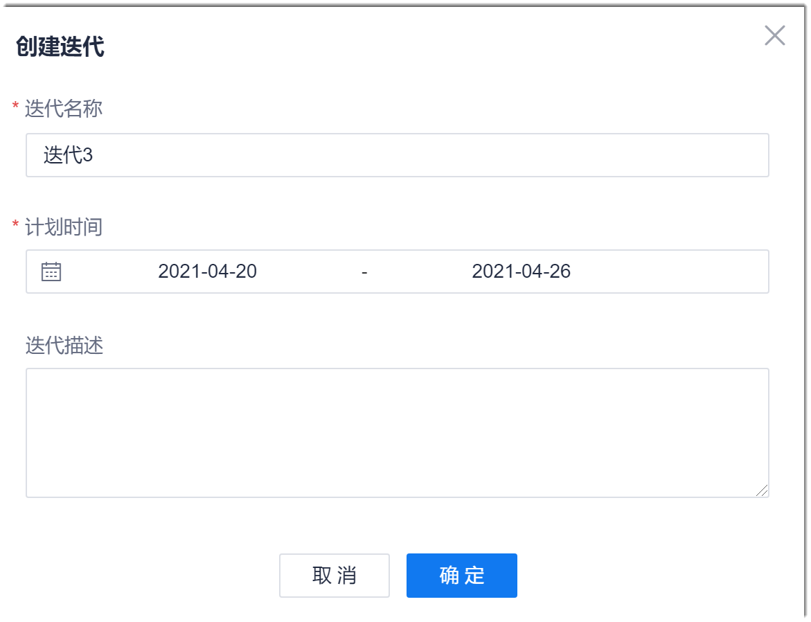

# 创建迭代

在创建迭代时，需要规划迭代的开始、结束时间，迭代的目标。

### 操作步骤
1. 在项目顶部导航栏中，单击“迭代冲刺”。                            
     左侧页面显示迭代（分为“未开始”、“当前的”和“已结束”三种迭代类型分类显示），右侧显示迭代待办列表。也可以单击左右侧分界附近的按钮，将左侧页面收起。                        
                                    
2.  在左侧迭代列表右上角中，单击。                  
                         
3. 在弹出的“创建迭代”对话框中，设置“迭代名称”、“计划时间”、“迭代描述”，单击“确定”。             
    您可以将迭代目标放到迭代描述中。              
     
  
迭代创建成功后，右侧页面显示新建迭代的待办事项。刚刚新建的迭代右侧显示空白。在[迁移工作项](16.2.3.3-migartion-backlog.md)时，填写工作项的“迭代版本”，即可将工作项纳入对应的迭代中。

> [!TIP]
> 需要展开或收起迭代类型下面的迭代时，请单击迭代类型后面的“查看” 或“收起”。