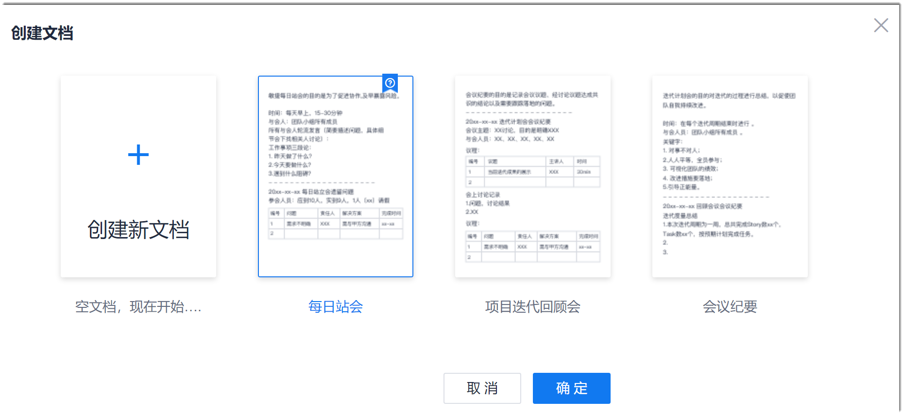
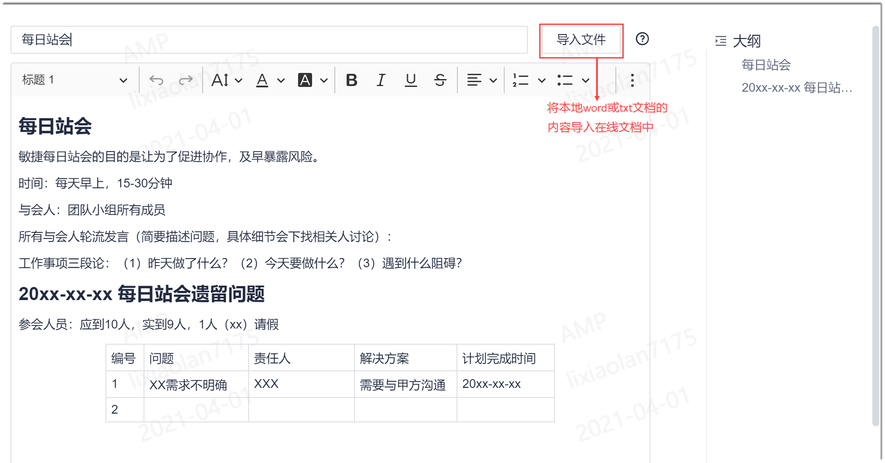

# 迁移项目文档

项目相关的TXT文档或word文档，可以导入到系统中，托管到“知识库”中进行统一管理。

### 操作步骤
1. 在项目顶部菜单栏中，单击“知识库”。
2. 创建目录。
  * 创建一级目录：单击左侧“目录”后面的。
  * 创建其它级别的目录：鼠标移动到父目录文件夹，单击后面的“ > 创建文件夹”，或者单击父目录文件夹，在右侧界面中单击“添加内容 > 创建文件夹”。
3. 创建文档。     
  1. 鼠标移动到所属文件夹，单击后面的“ > 创建文档”，或者单击所属文件夹，在右侧界面中单击“添加内容 > 创建文档”。
  2. 选择文档模板，或者单击“创建新文档”，单击“确定”。       
             
    进入文档编辑页面。                
  3. 输入文档的名称，然后单击标题后面“导入文件”，导入本地的TXT或word文件。      
  导入成功后，本地文件中的内容将添加到正文中。                      
                       
  4. 如果文档有附件，还可以将附件文档拖拽到“附件”区域中，上传附件。
  5. 编辑完成后，单击下方的“保存”。
     
     显示此文档的查看界面。

