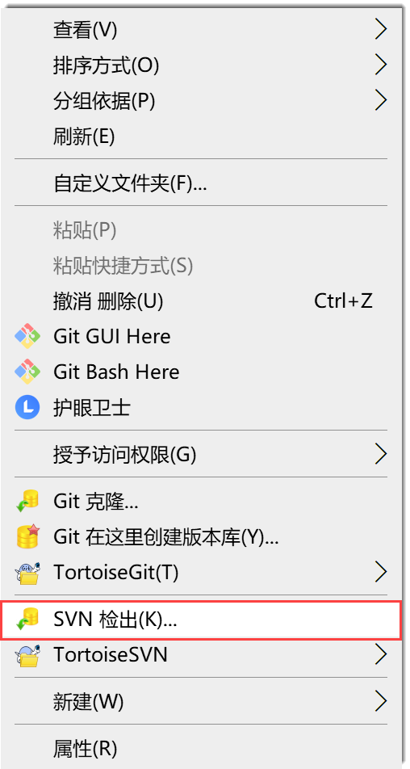
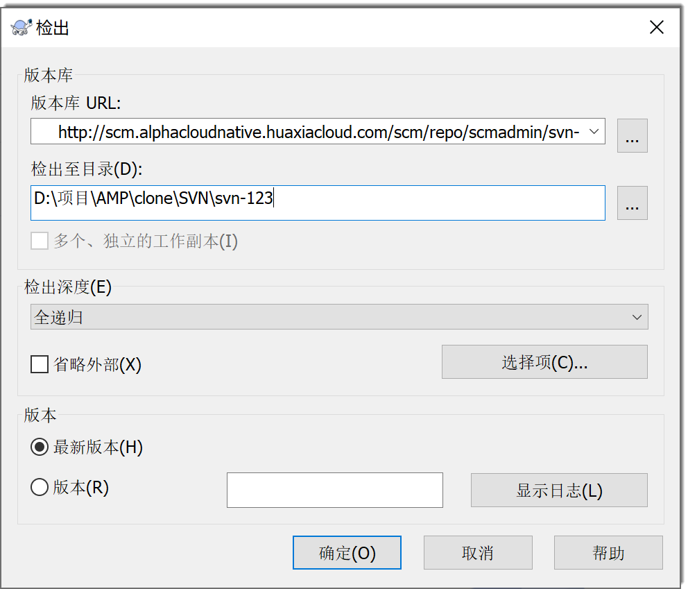

# 迁移已有代码

SVN代码通过TortoiseSVN客户端迁移。

### 通过TortoiseSVN客户端迁移代码
1. 克隆仓库。
  1. 在代码库列表中，单击SVN类型的代码仓库，进入代码仓库详情界面。
  2. 单击“代码”页签，然后在右上角单击“克隆”。
  3. 在按钮下方显示的对话框中，单击“复制”，复制仓库地址。                          
                      
  4. 进入本地存放代码仓库的目录，右键单击空白处，选择“SVN检出”。                         
                               
  5. 在“检出”对话框中，将刚刚复制的代码仓库地址粘贴到“版本库URL”中，其它参数保持默认值，单击“确定”。                     
                                
  6. 在弹出的“认证”对话框中，输入具有该仓库操作权限的CAP账号和密码，单击“确定”。                      
                              
      仓库成功克隆到本地后，目录中显示名称为仓库名称的文件夹。                        
2. 将原代码库中的内容全部拷贝到本地代码库目录中。                       
3. 将本地内容提交到远端仓库。
  1. 在修改所在的文件夹中，单击右键，选择“SVN提交”。                 
  2. 在提交对话框中，输入提交说明，勾选需要提交的文件，单击“确定”。                   
  3. 在提交完成的提示框中，单击“确定”。

本地代码库的内容已推送到远端仓库。您可以打开CAP的代码库查看。

