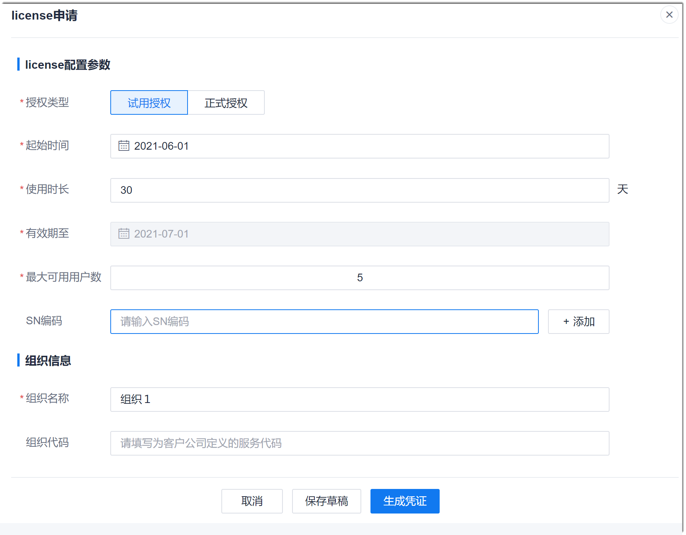

# 申请License

收到License申请请求后，您可以在系统中申请License，然后下载License文件，发送给对应人员。

### 前提条件
XXXX

### 操作步骤
1. 在系统任意界面的左上角，单击“ > 软件许可管理”。      
  XXXXXX         
  右侧显示已申请的License。        
2. 在右上角单击“申请凭证”。           
      
  
3. 在“license申请”界面中，根据下表的描述，填写License的信息，单击“生成凭证”，可生成License文件。后续可直接下载文件，发送给客户。       
  如果单击“保存草稿”，则不会生成License文件，只保存配置。             
         
   <table>
<tr>
   <th>参数名称</th>
    <th>说明</th>
</tr>
<tr>
    <td>授权类型</td>
    <td>根据实际情况选择试用授权或正式授权。试用授权最多可申请999天。正式授权最多可申请999月。</td>
</tr>
<tr>
    <td>起始时间</td>
    <td>自定义License的开始日期。</td>
</tr>
<tr>
    <td>使用时长</td>
    <td>License的有效时长。</td>
</tr>
<tr>
    <td>有效期至</td>
    <td>不可配置。根据“起始时间”和“使用时长”自动计算。</td>
</tr>
<tr>
    <td>最大可用用户数</td>
    <td>License可容纳的最大用户数，包含超级管理员。</td>
</tr>
<tr>
    <td>SN编码</td>
    <td>部署系统的服务器序列号。</td>
</tr>
<tr>
    <td>组织名称</td>
    <td>填写合同上的组织名称。</td>
</tr>
<tr>
    <td>组织代码</td>
    <td>表示为客户定义的服务代码。</td>
</tr>
</table>
4. 在License列表中，单击，下载License文件。
> [!NOTE]
> 在申请License界面中，单击“生成凭证”后，License列表的“操作”列显示按钮；单击“保存操作”，则License列表的“操作”列显示按钮。

