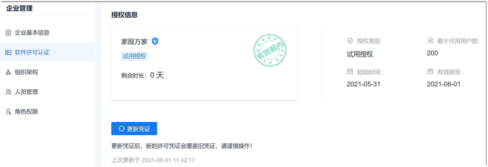

# 加载License

系统需要加载License后，才能正常提供服务。

### 前提条件
* 已使用具有企业“软件许可证 > License认证”权限的账号登录系统。
* 已获取License文件。

### 背景信息      
License到期后的1个月内，对于项目群和项目的所有内容，系统所有用户均只能查看内容，不能执行其他操作。License到期后的1个月之后，只有超级管理员可以登录系统，并且对于项目群和项目的所有内容只有查看权限，其他用户不能登录系统。

### 操作步骤
1. 在系统任意页面的左上角，单击“ > 企业管理”。      
2. 在企业管理的左侧导航栏中，单击“软件许可证”。    
  右侧页面显示当前的License信息。       
               
3. 在右侧页面中，单击“更新凭证”。
4. 在弹出的对话框中，上传新的License文件，单击“继续”。      
  系统显示更新成功，则License加载成功。单击“关闭”后，页面返回登录后的首页面（即项目总览页面）。
 
