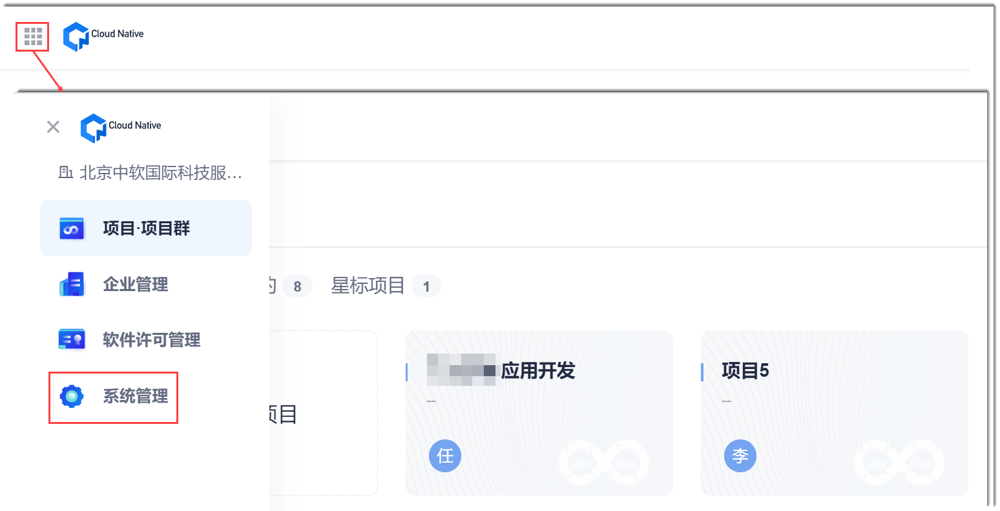
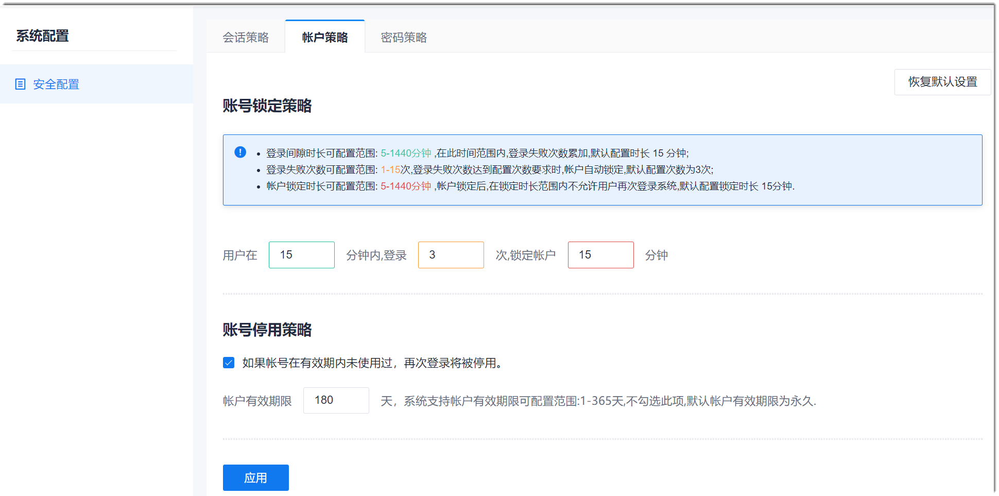

# 配置账号锁定和停用策略

账号锁定策略是指账号在多长时间内，连续登录错误多少次，锁定多长时间。        
账号停用策略是指账号在多长时间内未使用，则停用账号。

### 前提条件
* 已使用具有“安全配置”权限的账号登录系统。

### 操作步骤
1. 在系统任意界面的左上角，单击“ > 系统管理”。      
                  
2. 在左侧导航栏中，单击“安全配置”。
3. 在右侧页面中，单击“账户策略”页签。
4. 根据实际需求配置策略，单击“应用”。     
  * 配置账号锁定策略。      
    在“账号锁定策略”区域中，配置账号**在多长时间内，连续登录错误多少次，锁定多长时间**。
  * 配置账号停用策略。        
    如果需要配置停用策略，则勾选“如果账号在有效期内未使用过，再次登录将被停用”。然后配置**有效期限**。         
     

  账号满足条件被停用后，您也可以[解除账号停用](4.3-employee.md#解除账号停用)。解除停用后，账号就可以正常登录了。               
  
如果设置后，需要恢复到默认状态，则单击右上方的“恢复默认设置”。