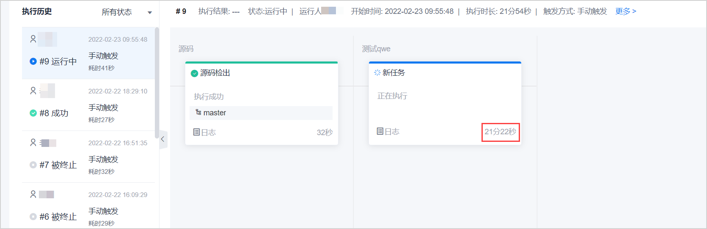
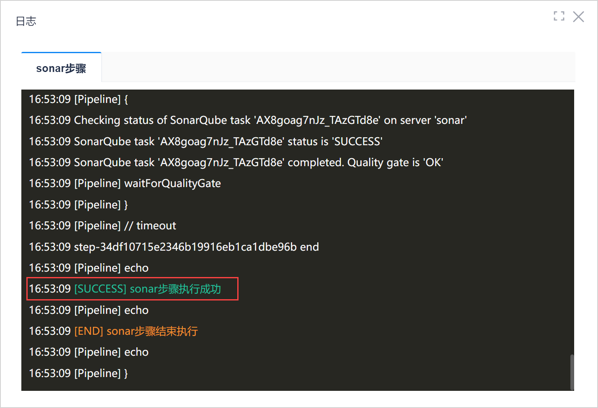
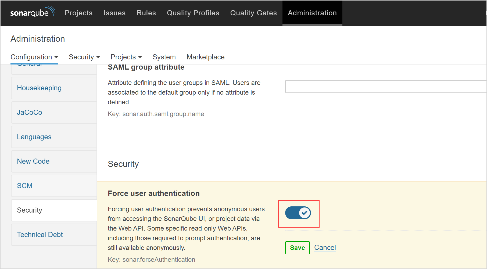
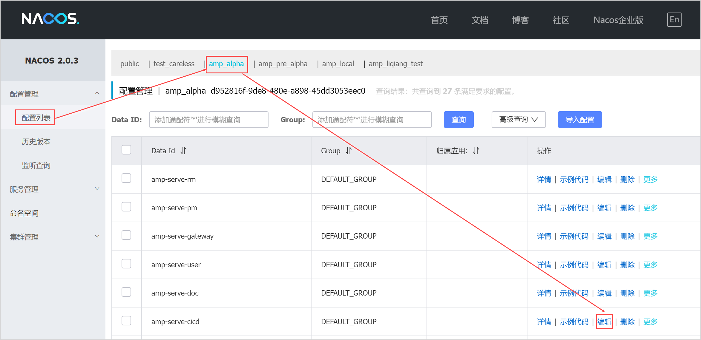
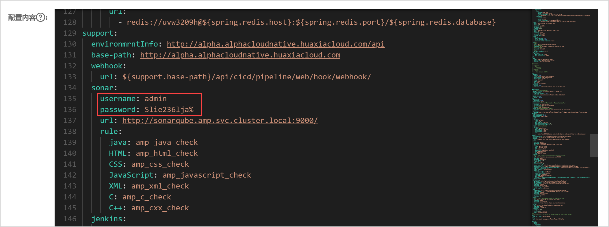
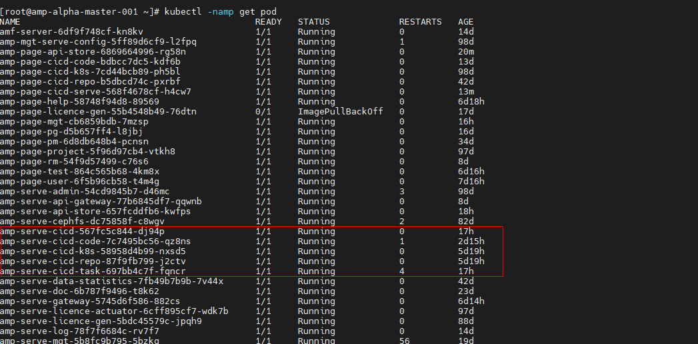

# 代码检查长时间处于执行中状态

### 问题现象                 
代码检查任务或者流水线中的代码检查任务一直处于执行中状态，执行时间超过10分钟，如下图所示。         
         
单击Sonar检查的日志，日志最后显示“sonar步骤执行成功”。        
         

### 根因分析        
登录系统的Sonarqube，在“Administration > Configuration > Security”中查看Security开关是否开启：
* 如果开启，请先检查网络是否正常。如果网络正常，则问题可能是由于修改了Sonar密码导致的，需要在系统配置文件和CICD服务中同步修改后的密码，详细操作步骤见[解决方案](#解决方案) 。          
* 如果未开启，请联系运维人员排查。       
               
     
### 解决方案            
> [!WARNING]
> 此解决方案需要访问并修改系统配置文件，建议由运维人员执行，避免配置错误带来的问题。         

1. 停止代码检查任务。
2. 访问系统的nacos域名，并登录nacos。        
  一般来说，系统的nacos域名为：nacos._系统域名_。             
2. 在nacos的左侧导航栏中，单击“配置管理 > 配置列表”。                     
3. 在右侧页面中，单击系统环境的页签。然后找到CICD的服务配置文件，单击后面的“编辑”按钮。
               
  
4. 在“配置内容”中找到sonar的用户名和密码配置，将配置改为最新的sonar用户名和密码。然后单击右下角的“发布”。          
   
5. 重启相关服务。       
  1. 在K8s管理节点上，执行**kubectl -namp get pod**命令，查看服务的具体名称。例如，CICD相关的服务如下图所示。
           
  2. 依次执行“**kubectl -namp delete pod _服务名称_**”命令，重启所有相关服务，使配置生效。            
    例如，需要重启上图中的第一个CICD服务，则执行“**kubectl -namp delete pod amp-server-cicd-567fc5c844-dj94p**”命令。

6. 重新执行代码检查任务，验证问题是否已解决：
  * 如果已解决，则问题处理结束。
  * 如果未解决，请联系运维人员处理。

