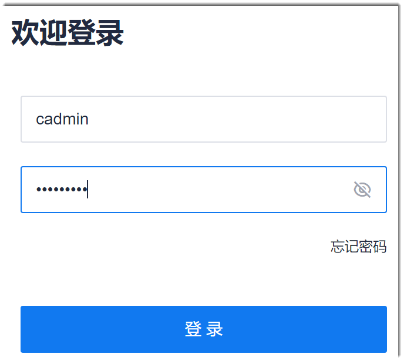
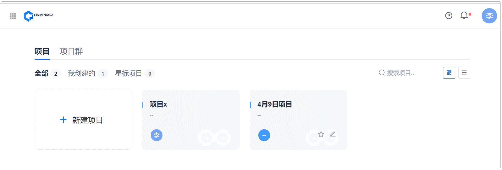
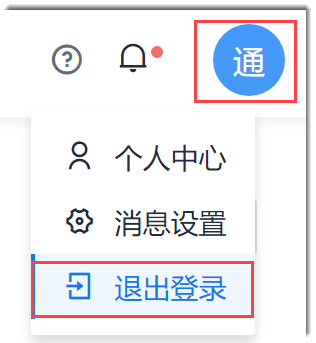

# 登录和退出系统

拥有系统账号和密码后，您可以登录系统，查看或操作相关内容。登录系统后，您也可以退出系统。     

### 前提条件
* 拥有系统的登录账号和密码。

### 登录系统
1. 在浏览器的地址栏中输入并前往部署时配置的系统域名。
2. 输入账号和密码，单击“登录”。      
                  
      其中，账号可以是“用户名”、手机号码或者邮箱地址。单击密码框后面的，可以显示密码。              
      如果您在15分钟内，连续登录失败次数达到5次，则您的账号将被锁定15分钟。15分钟后自动解锁。账号被锁定后，不能登录系统。账号被锁定后，除了等待15分钟自动解锁，也可以联系管理员手动解锁。

登录成功后，首页面显示项目总览。
 

### 退出系统
在系统页面右上角，单击“_登录用户的姓名简称图标_ > 退出登录”，例如：       

退出成功后，系统返回登录页面。

