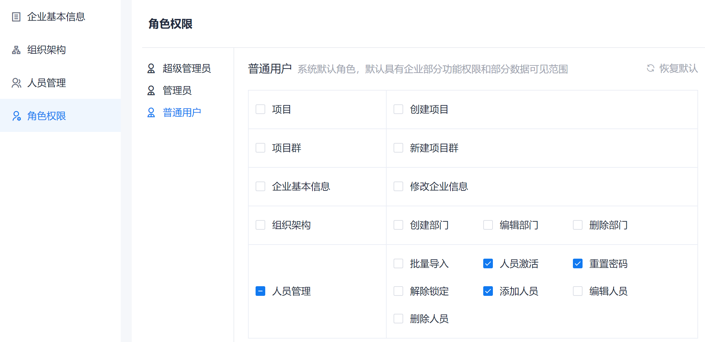

# 管理角色权限

CAP预置了超级管理员、管理员和普通成员三个角色。企业角色的权限主要涉及企业基本信息、组织架构、人员管理、角色权限、项目和项目群。        
超级管理员的权限固定，不能配置。您可以配置管理员和普通成员的企业级权限。

### 前提条件
* 已使用超级管理员或管理员角色的账号登录系统。

### 背景信息            
系统预置的三个角色从角色级别上，超级管理员 > 管理员 > 普通用户。企业管理权限中，对于“解除锁定”权限，角色具备本级和下级角色的“解除锁定”权限；对于其它权限，角色只具备下级角色的相应权限。

例如，“管理员”角色只具备“普通用户”角色的人员添加、编辑、删除权限，具备“管理员”和“普通用户”角色的账号解除锁定。如果需要创建“管理员”角色的账号，只能由超级管理员创建。

超级管理员角色每个企业只能有1个账号，在企业初始登录系统时创建。管理员和普通成员角色每个企业可以创建多个账号。
三个企业角色的默认权限如下表所示：

|权限类别|权限|超级管理员|管理员|普通成员|
|:--------- |:-------- |:----- |:--|:--|
|系统管理|日志查看|&#9745;|&#9745;|&#9744;|
|系统管理|日志导出|&#9745;|&#9745;|&#9744;|
|系统管理|安全配置|&#9745;|&#9745;|&#9744;|
|软件许可认证|license认证|&#9745;|&#9744;|&#9744;|
|项目|创建项目|&#9745;|&#9745;|&#9744;|
|项目群|新建项目群|&#9745;| &#9745;|&#9744;|
|企业基本信息|修改企业信息|&#9745;|&#9745;|&#9744;|
|组织架构|创建部门|&#9745;|&#9745;|&#9744;    |
|组织架构|编辑部门|&#9745;|&#9745;|&#9744;   |
|组织架构|删除部门|&#9745;|&#9745;|&#9744;   |
|人员管理|禁止登录|&#9745;|&#9745;|&#9744;|
|人员管理|解除停用|&#9745;|&#9745;|&#9744;|
|人员管理|批量导入|&#9745;|&#9745;|&#9744;   |
|人员管理|人员激活|&#9745;|&#9745;|&#9744;   |
|人员管理|重置密码|&#9745;|&#9745;|&#9744;|
|人员管理|解除锁定|&#9745;|&#9745;|&#9744;   |
|人员管理|添加人员|&#9745;|&#9745;|&#9744;   |
|人员管理|编辑人员|&#9745;|&#9745;|&#9744;|
|人员管理|删除人员|&#9745;|&#9745;|&#9744;   |

### 设置角色的权限
1. 在系统任意页面，单击左上角的“ > 企业管理”。
2. 在左侧导航栏中，单击“角色权限”。                         
     显示角色及权限页面。默认显示“超级管理员”角色的权限。单击角色名称，可以查看角色的权限。                     
3. 单击需要设置权限的角色，例如“普通用户”，然后在右侧界面中勾选角色需具备的权限，去勾选不需要具备的权限。                 
      
> [!NOTE]
> 您可以单击页面右上角的“恢复默认”，将角色的权限恢复到默认权限。
      
退出当前页面后，系统自动保存。