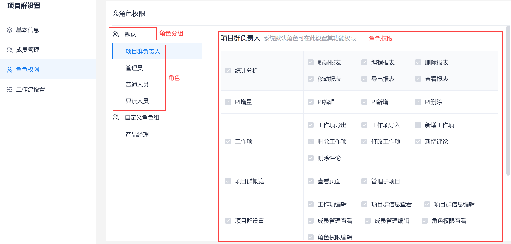
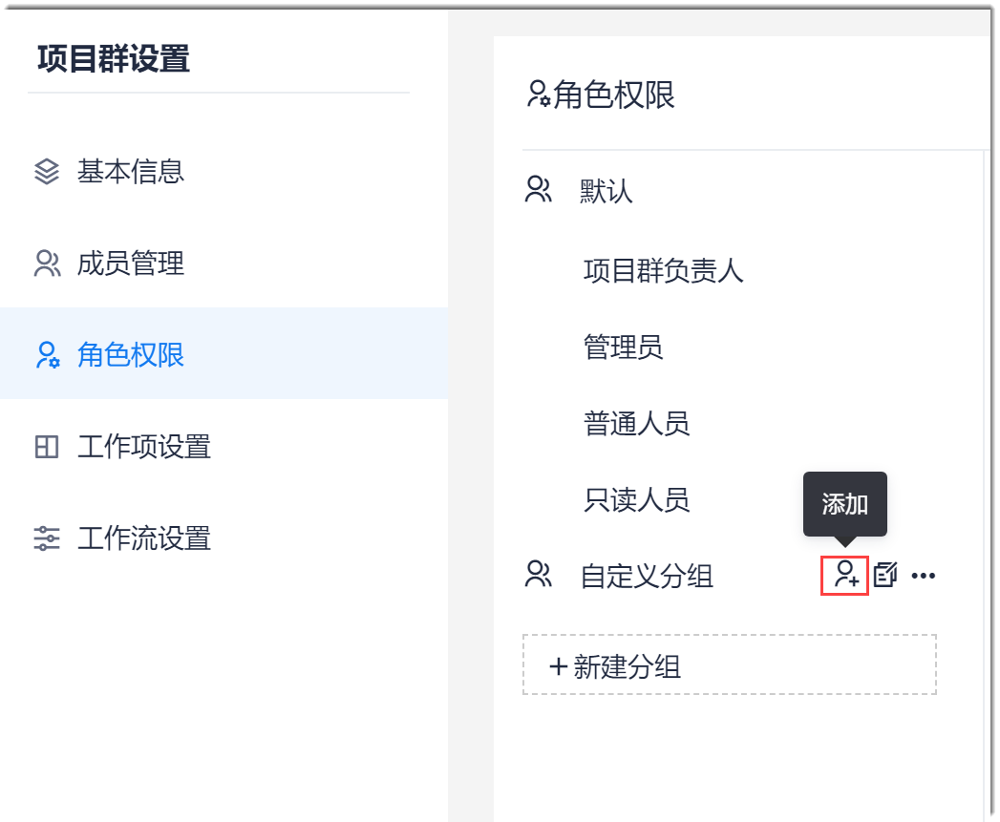
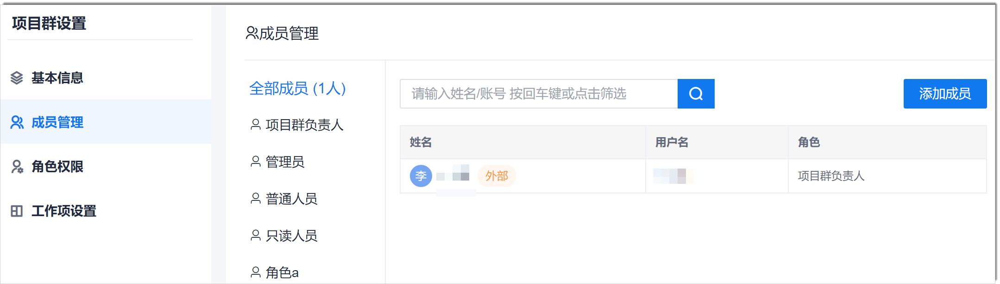
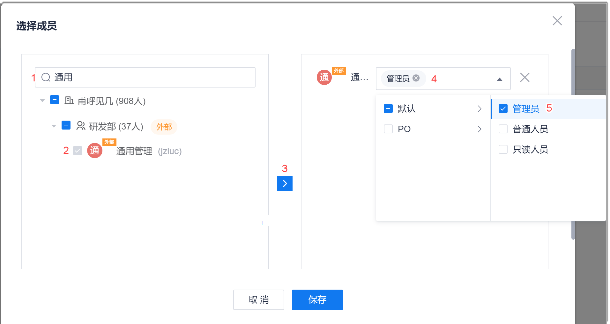
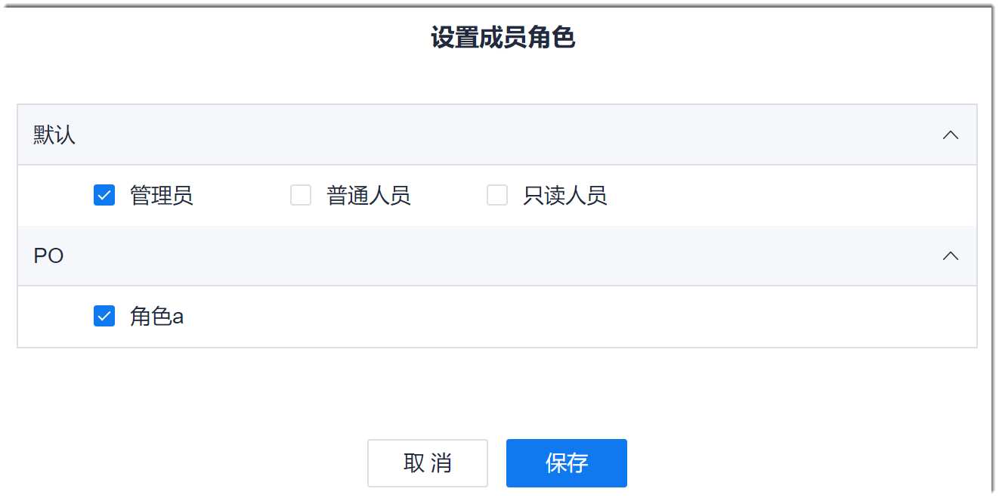

# 管理项目群成员、角色、权限

项目群创建成功后，需要将项目群成员加入到项目群中。之后，项目群成员才能具备项目群的查看和操作权限。

### 前提条件
* 已使用具有项目群“角色权限编辑”和“成员管理编辑”权限的账号登录系统。

### 背景信息
因为项目群是企业中的某一个项目群，所以项目群成员必须首先是企业成员。      
成员的权限通过角色赋予。将项目群成员设置为某个角色后，成员自动继承角色的权限。系统支持将一个成员设置为多个角色。系统预置的角色及其默认权限如下表所示。

|功能  |功能权限|项目群负责人默认权限|管理员默认权限|普通人员默认权限|只读人员默认权限|
|:--------- |:-----   |:-------- |:-----|:-----|:-----|
|统计分析|新建报表|&#9745;|&#9745;|&#9744;|&#9744;|
|统计分析|编辑报表|&#9745;|&#9745;|&#9745;|&#9744;|
|统计分析|删除报表|&#9745;|&#9745;|&#9744;|&#9744;|
|统计分析|移动报表|&#9745;|&#9745;|&#9745;|&#9744;|
|统计分析|导出报表|&#9745;|&#9745;|&#9745;|&#9744;|
|统计分析|查看报表|&#9745;|&#9745;|&#9745;|&#9745;|
|PI增量  |PI编辑|&#9745;|&#9745;|&#9744;|&#9744;|
|PI增量  |PI新增|&#9745;|&#9745;|&#9744;| &#9744;|
|PI增量|PI删除|&#9745;|&#9745;|&#9744;|&#9744;|
|工作项|工作项导出|&#9745;|&#9745;|&#9744;|&#9744;|
|工作项|工作项导入|&#9745;|&#9745;|&#9744;|&#9744;|
|工作项|新增工作项|&#9745;|&#9745;|&#9745;|&#9744; |
|工作项|删除工作项|&#9745;|&#9745;      |&#9745;|&#9744; |
|工作项|修改工作项|&#9745;|&#9745;|&#9745;|&#9744;|
|工作项|新增评论|&#9745;|&#9745;|&#9745;|&#9744; |
|工作项|删除评论|&#9745;|&#9745;|&#9744;|&#9744;|
|项目群概览|查看页面|&#9745;|&#9745;|&#9744;|&#9745;|
|项目群概览|管理子项目|&#9745;|&#9745;|&#9744;|&#9744;|
|项目群设置|工作流设置|&#9745;|&#9745;|&#9744;|&#9744;|
|项目群设置|工作项设置|&#9745;|&#9745;|&#9745;|&#9744;|
|项目群设置|项目群信息编辑|&#9745;|&#9745;|&#9744;|&#9744; |
|项目群设置|成员管理查看|&#9745;|&#9745;|&#9745;|&#9745;|
|项目群设置|成员管理编辑|&#9745;|&#9745;|&#9745; |&#9744; |
|项目群设置|角色权限查看|&#9745;|&#9745;|&#9745;|&#9744;|
|项目群设置|角色权限编辑|&#9745;|&#9745;|&#9744;|&#9744;|
|项目群|项目群删除|&#9745;|&#9745;|&#9744;|&#9744;|
|项目群|移交项目群负责人|&#9745;|&#9745;|&#9744;|&#9744;|
|知识库管理|查看文档|&#9745;|&#9745;|&#9745;|&#9744;|
|知识库管理|创建文档|&#9745;|&#9745;|&#9744;|&#9744;|
|知识库管理|编辑文档|&#9745;|&#9745;|&#9744;|&#9744;|
|知识库管理|删除文档|&#9745;|&#9745;|&#9744;|&#9744;|
|知识库管理|导出文档|&#9745;|&#9745;|&#9744;|&#9744;|
|知识库管理|移动文档|&#9745;|&#9745;|&#9744;|&#9744;|
|知识库管理|分享在线文档|&#9745;|&#9745;|&#9745;|&#9744;|
|知识库管理|新增文档评论|&#9745;|&#9745;|&#9745;|&#9744; |
|知识库管理|删除文档评论|&#9745;|&#9745;|&#9744;|&#9744;|

系统的项目群角色有角色级别，级别从高到低依次为：负责人、管理员、普通人员。负责人固定拥有项目群全部权限，高级别的角色可以为低级别角色配置权限。       
您也可以根据实际情况创建新的角色。高级别的角色只能创建低级别的角色，为低级别的角色重新配置权限。默认角色不能被重命名或者删除。       

**如何判断自定义的角色为哪个级别的角色**：拥有“项目群信息编辑”、“成员管理编辑”、“角色权限编辑”中的任意一个权限则为“管理员”级别的角色。否则为“普通人员”级别。

项目群成员、角色、权限与项目的成员、角色、权限相互独立，互不相关。

### 操作入口         
在项目群顶部菜单栏中，单击“项目群设置”。

### 管理角色及权限         
1. 在左侧导航栏中，单击“角色权限”。        
  右侧界面显示角色分组、角色、角色权限。                   
            
2. （可选）创建分组。                        
    如果当前默认角色能满足需求，您可以在自定义的分组下面创建角色，不能在默认分组下创建角色。                            
  1. 在角色权限界面中，单击“新建分组”。
  2. 在新建分组对话框中，输入分组名称，单击“确定”。
  
  创建成功后，如果需要修改组名或者删除分组，鼠标放在分组上，单击分组后面的 或“ > 删除”。                       
 当分组下有角色时，不能直接删除分组。请先将角色移出分组后，再删除分组。
    
3. （可选）创建角色。             
  如果当前默认角色能满足需求，您可以在自定义的分组下面创建角色，不能在默认分组下创建角色。                  
  1. 鼠标放在自定义分组上，单击 。                              
                        
  2. 在添加角色对话框中，设置角色名称，单击“确定”。                    
    其中，角色名称只支持1~20个中文和英文字母。                             
   创建成功后，如果需要修改角色或者删除角色，鼠标放在角色上，单击角色后面的 或“ > 删除”。默认角色不能被重命名或删除。                                     
4.  配置角色的权限。                       
     不能配置项目群负责人的权限。                              
  1. 在角色权限页面左侧，单击需要配置权限的角色。
  2. 在右侧界面中，勾选需具备的权限，去勾选不需要具备的权限。                         
                                
  3. （可选）如果需要恢复默认权限，单击右上角的“恢复默认”。
   
   退出该角色的权限编辑页面后，系统自动保存。
   
### 管理项目群成员                      
对于系统预置的项目群角色，从角色级别上，项目群负责人 > 管理员 > 普通人员 > 只读人员。设置成员的角色时，只能将成员设置为比当前用户低级别的角色和自定义的角色。

#### 添加成员
1. 在项目群设置页面的左侧导航栏中，单击“成员管理”。                            
    右侧页面显示角色及成员列表。                                 
                                
2. 在成员管理页面右上方，单击“添加成员”。
3. 在“选择成员”对话框中，勾选需要加入项目群的成员，单击，然后在右侧成员名称后面的下拉框中，选择成员所属的角色。                        
                             
4. 所有成员选择完成后，单击“确定”。

返回成员管理页面，显示项目群当前的成员列表。

#### 修改成员角色
1. 在项目群成员管理界面中，单击成员后面的“设置”。
2. 在“设置成员角色”对话框中，勾选需加入的角色，单击“保存”。                         
  
  
#### 移除成员
1. 在项目群成员管理页面中，单击成员后面的“删除”。
2. 在弹出的提示框中，单击“确定”。

成员被移除后，不再具有项目群的任何权限。

