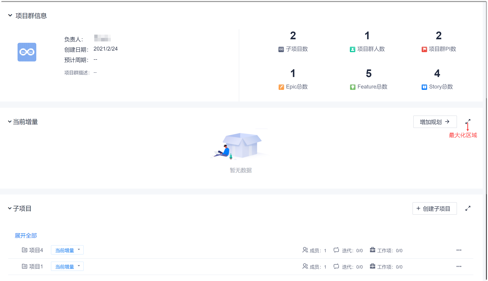
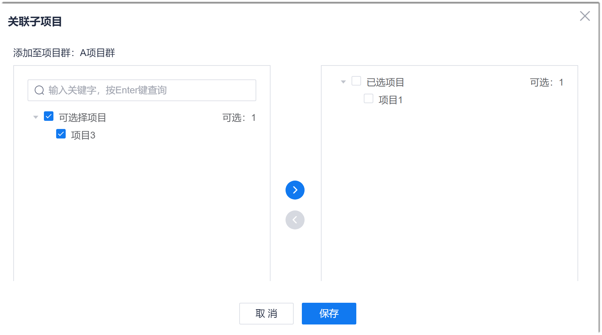
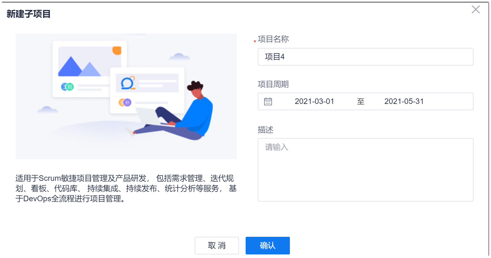

# 规划子项目

项目群的需求最终还是通过项目将需求分解到更细层级，并在具体项目中，实现、发布产品。因此，项目群创建完成后，还需要规划项目群包含的子项目。                 
您可以创建子项目，也可以关联已有的项目。

### 前提条件
* 已使用具备项目群“管理子项目”权限的账号登录系统。

### 操作步骤
1. 在项目群总览页面中，单击项目群。
2. 在项目群顶部菜单栏中，单击“项目群概览”。                       
     显示项目群的基本信息和当前增量（PI）、子项目情况。                         
                                     
3. 在子项目区域右侧，单击“创建子项目 > 关联子项目/新建子项目”。
  * **关联子项目**：                   
       在“关联子项目”对话框中，勾选子项目， 单击。选择完成后，单击“保存”。                        
                             
  * **新建子项目**：                      
       在“新建子项目”对话框中，输入项目名称、项目周期和项目描述，单击“确认”。                            
      

如果需将项目移出项目群，单击子项目右侧的“ > 移除项目”。

