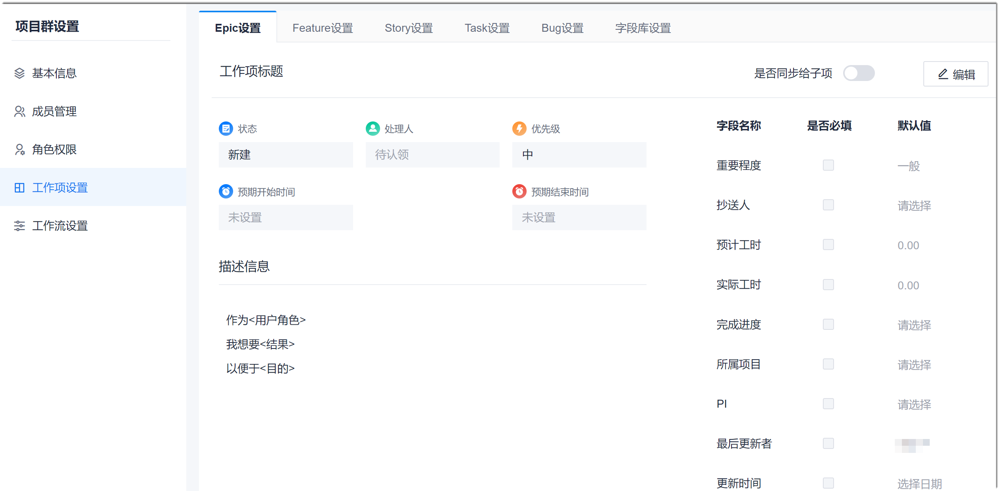
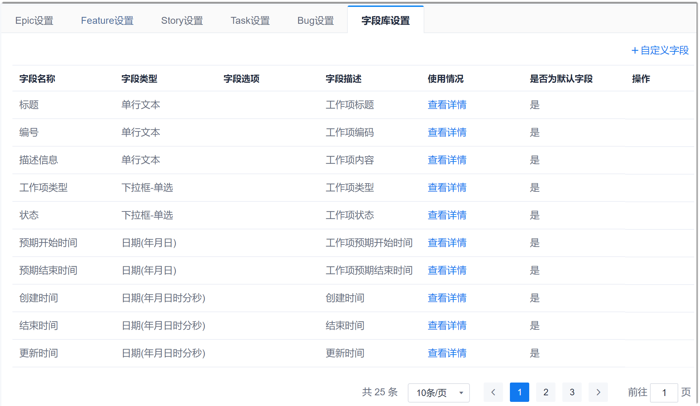
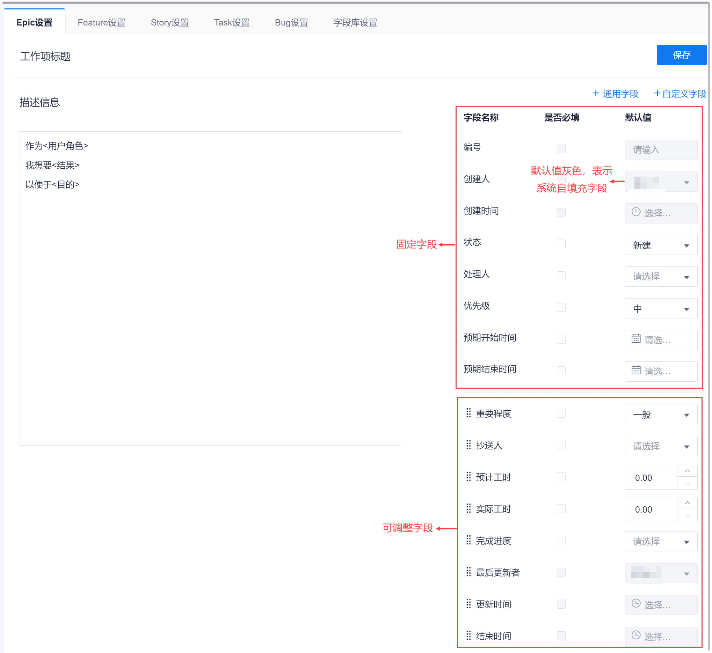

# 自定义工作项模板

项目群可以管理所有工作项类型模板。同时可以选择将项目群的工作项模板同步给指定的子项目。

### 前提条件
* 已使用具有项目群“工作项设置”权限的账号登录系统。

### 背景信息          
您可以选择将项目群的工作项模板同步给指定的子项目，详细请参见[同步基础信息到子项目](5.7.1.3-sych-basic-info-subproject.md)。           
在通用字段中，系统默认的字段不能被删除和修改，只能删除和修改自定义字段。在工作项字段中，系统默认的字段不能被删除，只能删除自定义的字段。

### 设置通用字段        
通用字段即所有工作项类型均可使用的字段。设置通用字段后，可在设置工作项类型的字段时引用。
1. 在项目群顶部菜单栏中，单击“项目群设置”。
2. 在左侧导航栏中，单击“工作项设置”。                     
     右侧界面显示工作项类型模板设置，以及通用字段设置。                    
                       
3. 在右侧页面中，单击“通用字段配置”页签。                    
     下方显示通用字段列表。                     
                 
4. 新增通用字段。                  
  1. 在列表右上方，单击“自定义字段”。
  2. 在“自定义字段”对话框中，设置“字段名称”、“字段类型”和“字段描述”，单击“确定”。                    
    对于单选框和多选框，可以设置选项的数据来源：采用“数据自定义”时，自己定义选项取值；采用“选择系统数据源”时，可选择使用系统的数据作为选项取值。当前支持使用项目成员作为选项取值。          
                     
    其中，字段类型的说明如下表所示。                                  
    
|字段类型|说明|
|:--------- |:-------- |
|单行文本|最多输入50个字符。|
|多行文本|最多输入200个字符。|
|下拉框-单选|需配置选项，每个选项不超过10个字符。|
|日期(年月日)|以yy-mm-dd格式显示日期。|
|数字|精确到小数点后2位。|
|下拉框-多选|需配置选项，每个选项不超过10个字符。|
|日期(年月日时分秒)|以yy-mm-dd h:m:s格式显示时间。|

新添加成功的字段显示在字段列表最后。

### 设置工作项类型的模板
1. 在工作项设置页面中，单击需要定义模板的工作项类型，例如“Epic设置”。
2. 根据实际情况设置是否将本工作项模板同步给子项目：
  * **同步**：将右上角的“是否同步给子项”开关置为ON，然后选中需要同步的子项目。
  * **不同步**：将右上角的“是否同步给子项”开关置为OFF。      
                   
3. 在页面右上方，单击“编辑”，然后根据实际情况修改内容：
  * 在“描述信息”中，修改工作项描述的模板。
  * 添加字段。
    * 添加通用字段。                  
      在页面右上方，单击“通用字段”。然后在弹出的“通用字段”对话框中，选择字段，单击“确定”。                  
    * 添加自定义字段。                 
      在界面右上方，单击“自定义字段”。然后在弹出的“自定义字段”对话框中，设置“字段名称”、“字段类型”和“字段描述”，单击“确定”。                
      对于单选框和多选框，可以设置选项的数据来源：采用“数据自定义”时，自己定义选项取值；采用“选择系统数据源”时，可选择使用系统的数据作为选项取值。当前支持使用项目成员作为选项取值。          
  * 设置“是否必填”和“默认值”。
  * 调整字段的显示顺序：在可调整字段区域中，拖拽带图标的字段到需要的位置。             
  * 删除自定义字段：单击自定义字段后面的。
    
> [!NOTE]
> 固定字段不能被调整顺序，系统自维护字段的值为系统填充，不能配置。

4. 设置完成后，单击界面右上方的“保存”。             

工作项模板设置成功后，已有的工作项和新建的工作项均会根据新模板同步更新。            
其它类型的工作项模板，请参照上述步骤定义。