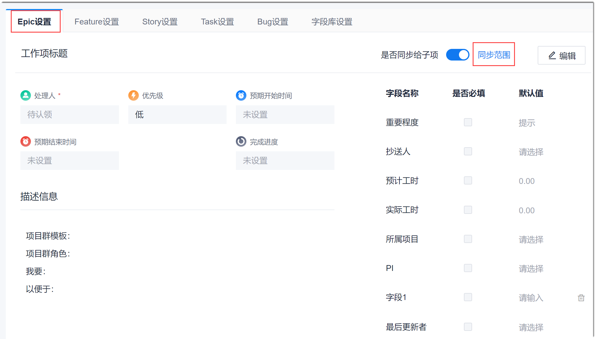
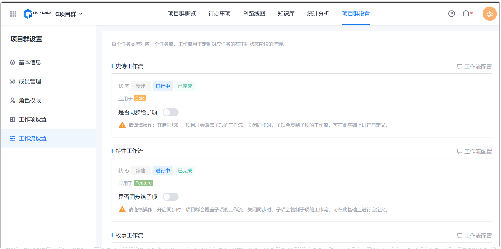
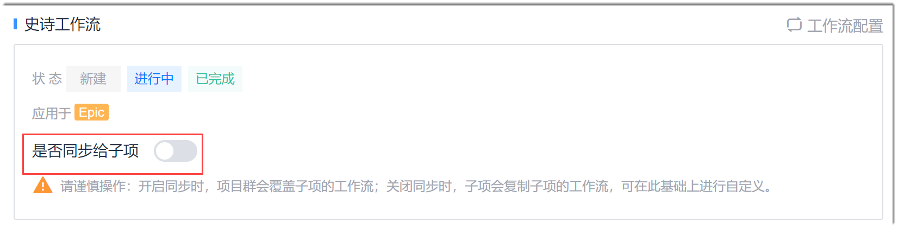
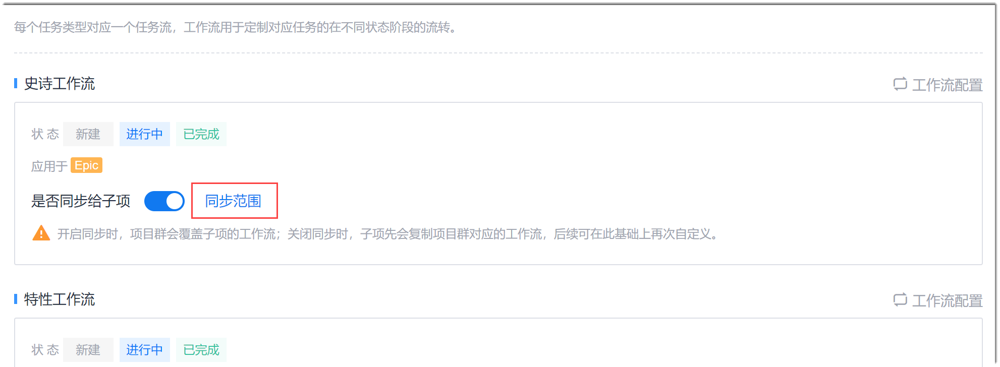

# 同步基础信息到子项目

项目群与子项目的数据上下拉通。您可以设置是否将项目群中工作项的基础信息（包括工作项模板、工作流）同步到子项目，使子项目继承项目群的配置。

### 前提条件
* 同步工作项模板：已使用具有项目群“工作项设置”权限的账号登录系统。
* 同步工作流：已使用具有项目群“工作流设置”权限的账号登录系统。

### 背景信息
* **同步工作项模板**        
  在项目群中，您可以选择将项目群的工作项模板同步给指定的子项目：                       
  **开启同步后**，如果选择将项目群的工作项模板同步给子项目，则子项目将继承如下表所示的信息。       
  <table>
<tr>
    <th>工作项中的信息</th>
    <th>继承处理方式</th>
</tr>
<tr>
    <td>包含的字段和字段的排列顺序</td>
        <td>继承项目群的工作项字段，并保留子项目原有的自定义字段。从项目群继承的字段不能被删除。子项目可以再调整字段的排列顺序。</td>
</tr>
<tr>
    <td>“描述信息”字段的内容</td>
    <td> 内容继承项目群的信息，子项目不能再重新定义“描述信息”。</td>
</tr>
<tr>
    <td>“是否必填” 字段 </td>
    <td>继承项目群对字段的“是否必填”设置，子项目不能再重新定义项目群字段的“是否必填”。</td>
    </tr>
</table>

  子项目从项目群继承工作项模板后，也可以再添加子项目自己的字段。子项目自行添加的字段不会影响项目群。     
    
  **撤销同步后**，子项目中的工作项模板保留项目群已经同步下来的内容（自定义字段除外），并且恢复对当前工作项模板的设置权限。

* **同步工作流 **          
  在项目群中，您可以选择将项目群的工作流同步给指定的子项目。       
   **开启同步后**，子项目直接继承项目群的工作流，不能再自定义工作流。如果子项目中存在项目群未定义的工作项状态时，处理方式如下表所示。
   <table>
<tr>
    <th>子项目中工作项显示界面</th>
    <th>原状态所属状态类别</th>
    <th>处理方式</th>
</tr>
<tr>
    <td>工作项列表和工作项详情 </td>
    <td>不涉及 </td>
    <td>显示原状态。但是在修改“状态”参数时，只显示当前已定义的状态。</td>
</tr>
<tr>
    <td rowspan="3">迭代看板</td>
    <td>原状态属于开始态 </td>
    <td>将卡片映射到新的开始态中。</td>
</tr>
<tr>
    <td>原状态属于进行态</td>
    <td>将卡片映射到进行态的第一个状态中。</td>
    </tr>
<tr>
    <td>原状态属于结束态</td>
    <td>将卡片映射到新的结束态中。</td>
    </tr>
</table>
   
   **撤销同步后**，子项目在同步后的状态下，恢复对工作流的所有操作权限。

新加入项目群的子项目默认不同步项目群的工作项模板和工作流。如果需要同步，请设置同步范围。

### 开启工作项模板的同步
1. 在项目群顶部菜单栏中，单击“项目群设置”。
2. 在左侧导航栏中，单击“工作项设置”。           
     右侧界面显示工作项类型的模板设置，以及通用字段设置。           
             
3. 单击需要定义模板的工作项类型，例如“Epic设置”。      
4. 根据实际情况设置是否将本工作项模板同步给子项目：
  * **同步**：将右上角的“是否同步给子项”开关置为ON，然后选中需要同步的子项目。
  * **不同步**：将右上角的“是否同步给子项”开关置为OFF。      
  

### 设置工作项模板的同步范围      
当工作项模板的同步开关开启后，如果需要修改同步的子项目范围，则按照如下步骤执行：         
1. 在项目群的工作项设置界面中，选择需要设置同步的工作项类型页签，然后在界面右上方，单击“同步范围”。      
              
2. 在弹出的对话框中，勾选需要同步的子项目，去勾选无需同步的子项目，单击“确定”。              
       
  
### 开启工作流的同步

1. 在项目群顶部菜单栏中，单击“项目群设置”。
2. 在左侧导航栏中，单击“工作流设置”。    
    右侧页面显示各类工作项的状态。      
            
3. 根据实际情况设置是否将工作项的工作流同步给子项目：    
  * **同步**：将工作项区域中的“是否同步给子项”开关置为ON，然后选中需要同步的子项目。     
  * **不同步**：将工作项区域中的“是否同步给子项”开关置为OFF。        
  

### 设置工作流的同步范围         
当工作流的同步开关开启后，如果需要修改同步的子项目范围，则按照如下步骤执行：         
1. 在项目群的工作项设置页面中，在需要设置同步的工作项类型区域中，单击“同步范围”。      
              
2. 在弹出的对话框中，勾选需要同步的子项目，去勾选无需同步的子项目，单击“确定”。              
       

