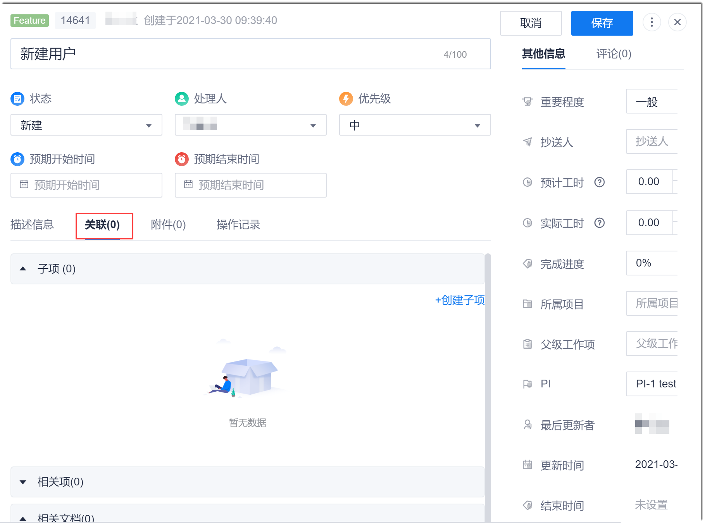

# 关联内容

工作项可以关联子工作项、相关工作项和相关的文档。

### 前提条件
* 已使用具有项目群“修改工作项”权限的账号登录系统。

### 操作步骤
1. 进入工作项详情界面，单击右上方的，编辑工作项。
2. 单击“关联”页签。                     
                          
3. 单击下方的“子项”、“相关项”或“相关文档”，可以查看当前已关联的内容。
4. 关联内容。
     在对应的区域下：
   * 单击“子项 > 创建子项”：在此工作项下创建子工作项。
   * 单击“相关项 > 添加相关项”：关联此工作项与其它已有的工作项。
   * 单击“相关文档 > 添加相关文档”：关联此工作项与“知识库”中的文档。
5. 关联完成后，单击界面右上方的“保存”。

关联子项后，在被关联的工作项的“关联 > 相关项”中也会显示此工作项。

  