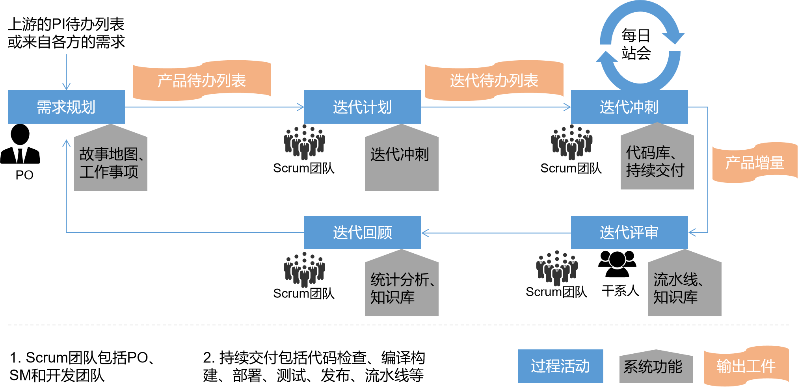
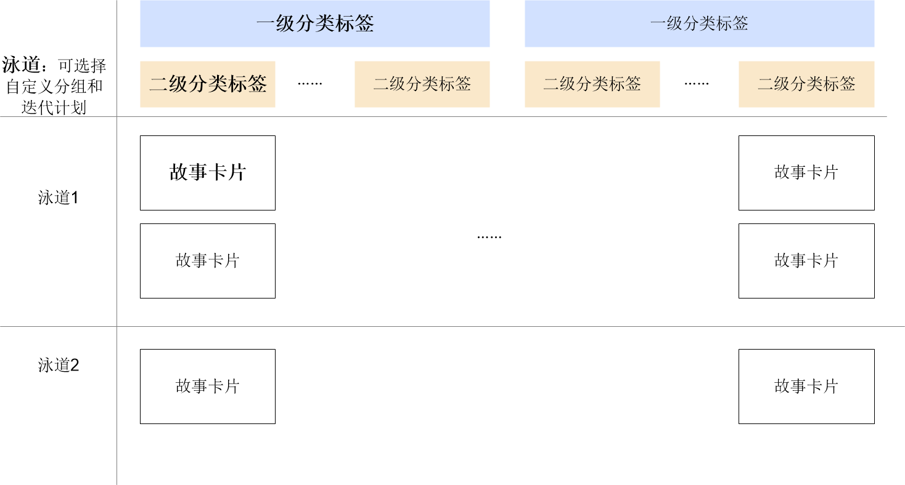

# 项目管理概述

CAP的项目管理秉承严谨的Scrum敏捷框架和实践，为软件开发团队提供敏捷项目管理与协作，支持项目自身管理、需求规划和管理、缺陷管理、迭代管理、自定义工作项模板和字段、自定义工作流、多维度看板、报表统计分析、项目文档管理等特性，支持从需求到交付端到端的可视化、透明化、高效率地管理项目。

> [!NOTE]
> 工作项（需求和缺陷）管理、迭代管理的内容单独介绍，不在本章中描述。详细请参见[需求&缺陷管理](7-backlog-management.md)和[迭代管理](8-sprint-management.md)。

### Scrum开发过程
Scrum是敏捷开发的主流方法，通过迭代冲刺的方式，持续交付，从用户需求到用户反馈实现每一个闭环的软件开发过程。
在Scrum过程中，涉及三个核心角色：PO、SM和开发团队；输出三个工件：产品待办列表、迭代待办列表和产品增量；执行五个事件：迭代计划会议、迭代冲刺、每日站会、迭代评审会议、迭代回顾会议。在整个过程中，所有参与人应遵循“勇气、开放、专注、承诺、尊重”的五大价值观。           

### 功能特性

* **需求模型**                  
  原始需求往往是宏观的、抽象的。在做需求规划和分解时，我们需要理解客户需求背后的问题本质，最终分解为每个迭代可交付的最小工作项。          
  CAP预置了SAFe实践中推荐的**Epic-Feature-Story**的需求模型。       
  从原始抽象宏观的需求Epic（中文通常翻译为史诗特性），分解为多个Feature，继而再逐步分解为Story。Story是User Story的简称，Story是站在用户视角符合INVEST原则的最小可交付的工作项单元。一个Epic分解为一个或多个Story，并根据开发团队的人力管道和Epic的计划时间，将Story规划到一个或多个迭代中持续交付。         
  在将需求分解给团队实现时，还需要将Story拆分为可落地到人的Task。当发现产品缺陷时，需要创建缺陷。因此，端到端的工作项模型为**Epic-Feature-Story-Task/Bug**。

* **用户故事地图**                    
    在敏捷中，我们会将需求拆分到Story（故事）这个层级。通过故事的方式来组织需要开发的产品。每个故事的实现都是整个产品密不可分的一部分。因此，故事的使用使软件开发的过程进一步可视化。但需求拆分后，容易丢失产品的全景图。                    
    用户故事地图就是在需求拆分过程中保持全景图的一门技术。              
  CAP的用户故事地图横向支持两层分类标签，并且支持多维度的多泳道个管理，可以适应不同场景下的用户故事地图。                       
    
    
* **迭代管理**                       
    迭代也是Scrum中的Sprint（冲刺），是重复式的持续交付并持续获取反馈的软件开发活动。每个迭代均需交付对客户或者用户有价值的增量，即每个迭代需完成一定量的工作项（需求或缺陷）。                      
    每个迭代的节奏一致，有固定的开始和结束日期。                                 
    CAP支持规划每个迭代的时间周期、完成的工作项，并支持跟踪和管理工作项的进展、阻碍、风险。
    
* **多视角看板**                 
    不同的团队、不同的项目、不同的场景下关注的信息不同。CAP在迭代中，支持多视角的迭代看板，包括：以用户故事视角的任务（Task）看板、以团队成员视角的任务看板、故事看板。从多个维度使工作可视化。
    
* **自定义工作项模板**               
   为了适应不同场景下的工作项内容需求，CAP的工作项内容并非固定的，而是可以自定义的。您可以新增字段、调整字段的顺序、修改字段默认值等。
    
* **自定义工作流**                 
    为了适应不同团队对工作项流转方向的需求，CAP支持自定义工作项的状态，并且自定义工作项的状态流转方向。
    
* **文档知识管理**                
   您可以将项目的各类文档，例如总结、架构文档、产品需求文档、会议纪要等通过知识库进行统一管理。CAP也支持将文档导入为云文档。项目成员采用统一的访问地址，随时可以访问和获取，便于项目信息的分享、项目经验的沉淀。
   
* **多维度统计报表**                
    CAP支持从敏捷交付、人力成本、质量内建、团队能效等方面统计项目情况，并且预置多种类型的报表模板。您可以在报表模板的基础上高效地创建统计报表。

### 优势特点
* **秉承敏捷方法论与实践**                 
    秉承敏捷管理、精益的软件项目管理理念，融合用户故事地图、四层需求模型等工具，支持迭代规划、迭代开发和可视化看板展示项目进展。
    
* **多视角多维度可视化**               
    支持敏捷交付、人力成本、质量内建、团队能效四个维度的多种统计报表，并支持多维度的报表对比分析。支持用户故事看板和任务看板，面向不同角色展示项目情况。
    
* **丰富的自定义**
  * 支持自定义工作项（需求和缺陷）的模板。
  * 支持自定义工作流（即工作项的状态及其流转方向）。
  * 支持自定义角色和权限。
  * 支持自定义通知策略。

