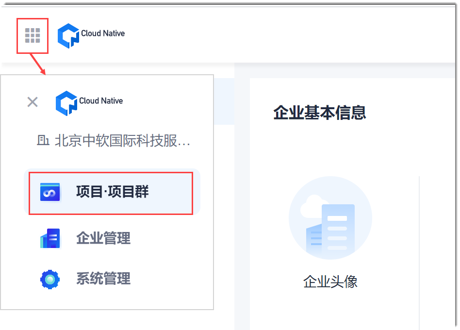

# 创建项目
在进行所有的项目工作前，您需要创建项目。

### 前提条件         
已使用具有“创建项目”权限的账号登录系统。“创建项目”的权限在“企业管理”中配置。

### 背景信息              
所有项目均为私有项目，只有项目成员才能看到项目。

### 创建项目
1. 进入项目总览页面。                      
    用户登录系统后，默认进入项目总览页面。如果您当前处于其它页面中，需要创建项目，则在页面左上角单击“ > 项目·项目群管理”，进入项目总览页面。                       
                           
2. 根据项目排列方式，进入新建项目页面：
  * 卡片方式排列时：在项目卡片最前面，单击“新建项目”。
  * 列表方式排列时：在项目列表右上方，单击“新建项目”。
3. 在“创建项目”对话框中，输入项目名称、项目周期和项目描述，单击“确认”。                 
     其中，“项目名称”支持最长30个字符。                  
     
     

