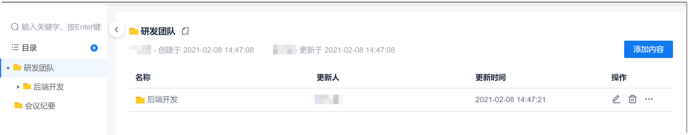

# 管理文档目录

系统支持通过文件夹的方式分层、分类管理文档。文件夹通过树状目录的形式展示，可清晰、轻松地管理。

### 创建文件夹                
知识库的初始界面中无任何文件夹和文件，您可以根据实际情况创建文件夹。                  
系统支持最多9层目录。同一级的文件夹和文件名称唯一。            
1. 在项目顶部菜单栏中，单击“知识库”。
2. 创建目录。
  * 创建一级目录：单击左侧“目录”后面的。
  * 创建其它级别的目录：鼠标移动到父目录文件夹，单击后面的“ > 创建文件夹”，或者单击父目录文件夹，在右侧界面中单击“添加内容 > 创建文件夹”。                 
3. 在弹出的“添加文件夹”对话框中，输入文件夹的名称，单击“确定”。       
     文件夹名称不能超过30个字符。                  
        

### 查看文件夹详情           
在“知识库”页面中，在目录上单击文件夹名称。               
              
* 如果文件夹下有文档或者子文件夹，则右侧界面显示文件或子文件夹列表，以及文件夹的创建人、创建时间、更新人、更新时间。                 
    单击文件或子文件夹可打开该文件或子文件夹。                
* 如果文件夹下无任何内容，则显示“当前文件夹无任何内容”的提示，并提供创建内容的按钮。

### 修改文件夹名称
1. 鼠标移动到文件夹，单击后面的“ > 重命名”；或者单击文件夹，然后单击右侧界面中文件夹名称后面的。
2. 在弹出的“修改文件夹名称”对话框中，输入文件夹的名称，单击“确定”。

### 移动文件夹位置            
移动文件夹后，文件夹及其中的内容（包括文件夹和文件）均会一同移动到新文件夹下。            
移动文件夹有两种方式：
* 选择移动
  1. 在鼠标放到文件夹上，单击后面的“ > 移动”。
  2. 在弹出的“选择移动位置”对话框中，选择其父文件夹，单击“确定”。
* 拖拽移动
    在文档目录中，拖拽文件夹到想要的位置。

### 导出文件夹             
导出文件夹会导出文件夹中的所有子文件夹和文档。文件夹导出到本地后，以“.zip”压缩包的格式存放。文档将以PDF格式导出。                  
通过以下任一方式下载文档：
  * 在知识库目录中，单击文档后面的“ > 导出”。
  * 单击所属的父文件夹，再单击右侧界面中文件夹后面的“ > 导出”。

### 删除文件夹            
删除文件夹时，文件夹下的内容也将一并被删除。删除后的文件夹放入“回收站”中30天。30天内，可在“回收站”中查看或恢复文件夹。
1. 通过以下任一方式下载文档：
  * 在知识库目录中，单击文件夹后面的“ > 删除”。
  * 单击所属的父文件夹，再单击右侧界面中文件夹后面的。
2. 在弹出的确认对话框中，单击“确定”。

