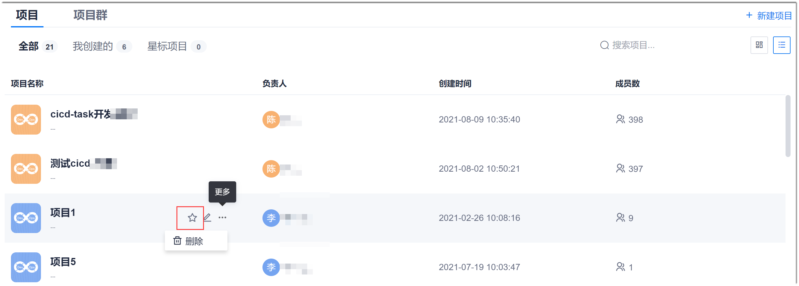
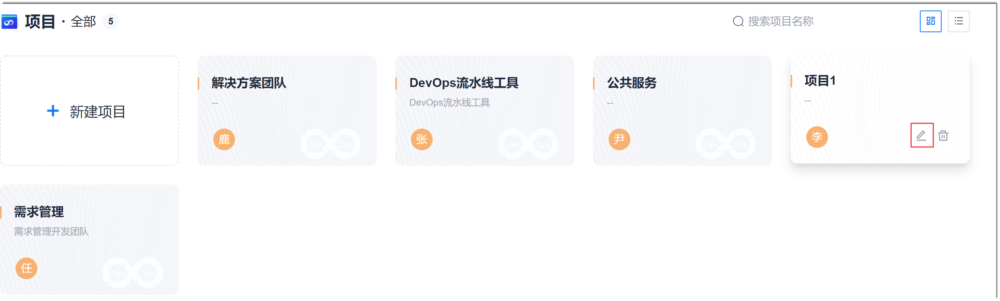
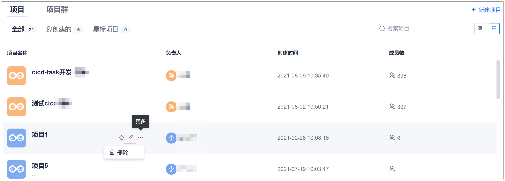
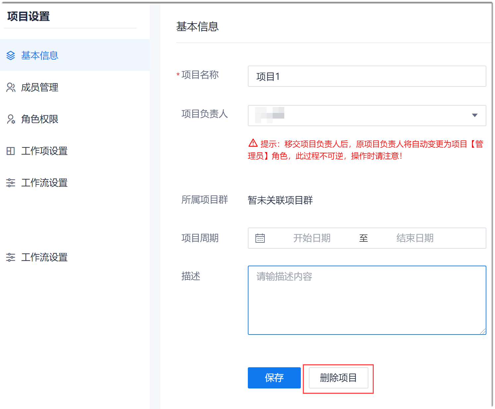

# 管理项目

介绍如何给项目打星标，分类查看项目，修改项目信息，删除项目，调整项目的位置。

修改项目是指修改项目的基本信息，包括项目名称、项目负责人、项目周期和项目的描述信息。其中，项目负责人变更后，项目负责人相关的权限也将一并移交，原项目负责人的角色自动修改为“管理员”。

当项目废弃后，您可以删除项目。项目被删除后，无法恢复，请谨慎操作。

### 给项目打星标
* 通过卡片界面：      
  在项目总览界面的“全部”页签中，鼠标移动到项目卡片上，单击。          
   
* 通过列表界面：    
   在项目总览界面的“全部”页签中，鼠标移动到项目上，单击。          
   

### 分类查看项目
在项目总览界面中，有三个页签，您可以分类查看项目：
* **全部**：所有“我”已加入的项目。
* **我创建的**：只显示“我”创建的项目。
* **星标项目**：只显示“我”打了星标的项目。

其中创建项目只能通过“全部”页签创建。

#### 修改项目信息                 
1. 在项目总览页面中，根据项目排列方式，进入新建项目页面：
  * 卡片方式排列时：鼠标移动到项目上，单击，进入项目基本信息页面。                     
                        
  * 列表方式排列时：鼠标移动到项目上，单击，进入项目基本信息页面。                     
                           
2. 在项目基本信息界面中，您可以修改项目的名称、项目周期和项目描述，并变更项目负责人。修改完成后，单击“保存”。                 
    
        

#### 删除项目            
1. 在项目总览页面中，鼠标移动到项目上，单击。
2. 在项目基本信息页面中，单击“删除项目”。                 
                       
3. 在弹出的确认对话框中，单击“确定”。

### 调整项目位置       
在项目卡片列表页面，您可以拖拽项目到想要的位置，调整项目的位置。在卡片页面调整位置后，位置信息会同步到列表页面。
