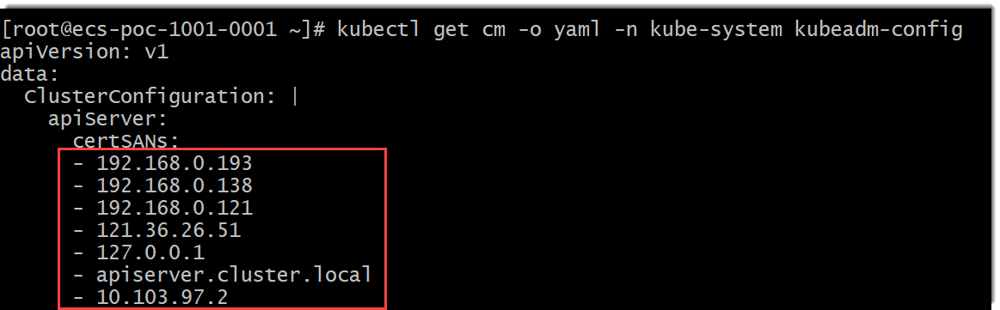
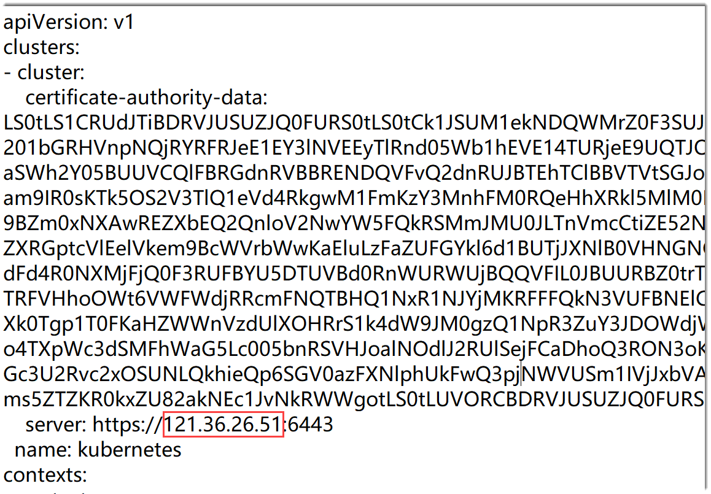
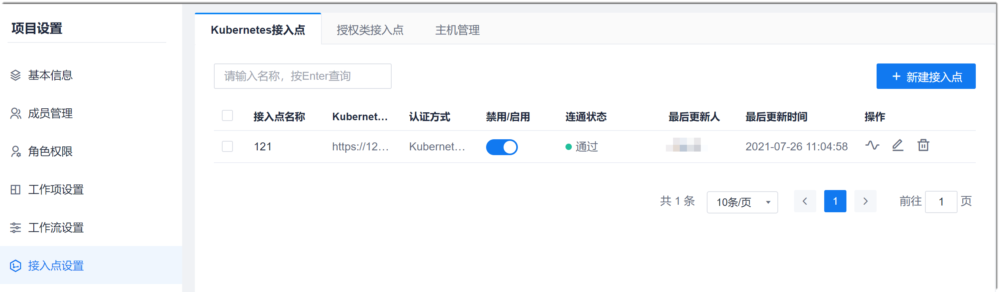
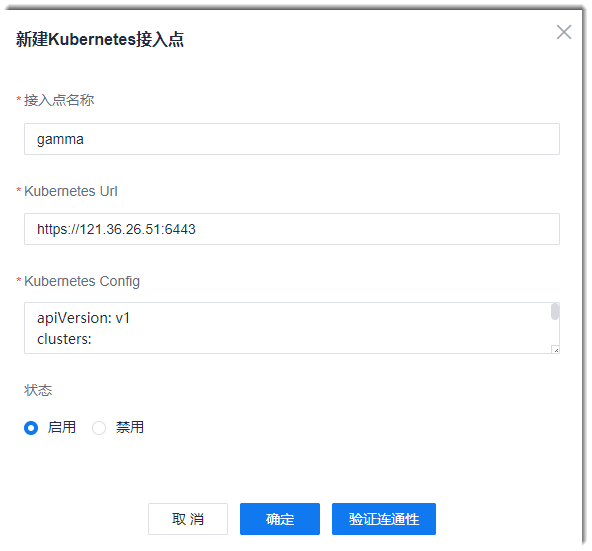

# 添加K8s接入点

### 前提条件
* 已完成K8s集群部署。

### 操作步骤
1. 获取K8s集群的“Kubernetes Url”参数。     
     打开K8s集群的配置文件。在K8s集群部署成功后，配置文件一般保存在“/etc/kubernetes”目录下的“XXX.conf”文件中。 配置文件中存储了系统与K8s集群建立连接的“Kubernetes Url”参数。     
            

  如果对应的server信息显示为内网信息，例如“ <b>server: https://apiserver.cluster.local:6443</b>”，则需要从K8s的可信列表中，选择能与系统连通的IP地址，替换server中的域名或IP地址。如果K8s集群采用kubeadm方式安装，可以执行“**kubectl get cm -o yaml -n kube-system kubeadm-config**”命令获取K8s的可信列表：              
    

  例如，能与系统连通的IP地址为“121.36.26.51”，则“Kubernetes Url”参数取值应该为“<b>https://121.36.26.51:6443</b>”。
   
2. 获取K8s集群的kubeconfig信息。         
  K8s集群的kubeconfig信息存放在master节点的“/root/.kube/config”文件中。获取“/root/.kube/config”文件的信息后，将文件中的“server”中的IP地址，改为与URL中的IP地址一样。位置如下图所示：        
        
  
4. 在项目顶部菜单栏中，单击“项目设置”。
5. 在左侧导航栏中，单击“接入点设置”。          
     右侧默认显示“Kubernetes接入点”页签，显示已添加的K8s接入点列表。          
              
     
6. 在右上方，单击“新建接入点”。
7.  在“新建Kubernetes接入点”对话框中，根据下表填写相关参数，单击“验证连通性”。              
            
  <table>
<tr>
   <th>参数名称</th>
    <th>说明</th>
</tr>
<tr>
    <td>接入点名称</td>
    <td>支持1~64个字母、数字、“-”、“_”字符。</td>
</tr>
<tr>
    <td>Kubernetes Url</td>
    <td>配置文件中的“server”取值。</td>
</tr>
<tr>
    <td>Kubernetes Config</td>
    <td>K8s master节点的“/root/.kube/config”文件的内容（文件中server的IP地址与“Kubernetes Url”一致）。</td>
</tr>
<tr>
    <td>状态</td>
    <td>启用：该K8s接入点可以在流水线的“K8s部署”步骤和应用管理中被发现。
禁用：该K8s接入点不能在流水线的“K8s部署”步骤和应用管理中被发现。
</td>
</tr>
</table>
8. （可选）如果连通性验证失败，请检查对应的配置是否正确。
9. 配置完成后，单击“确定”。

K8s接入点添加成功后，返回K8s接入点列表界面，显示新添加的接入点。

