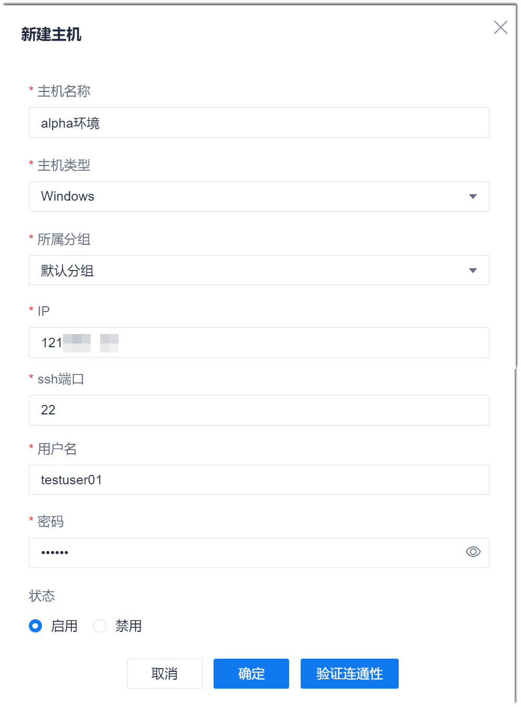

# 添加主机

### 前提条件
* 主机与系统可互联互通。

### 操作步骤
1. 在流水线列表界面中，单击右上角的“项目设置 > 接入点设置”。       
2. 在右侧界面中，单击“主机管理”页签。            
  进入主机列表界面。              
          
3. 在右上角单击“新建主机”。         
4. 在弹出的“新增主机”对话框中，根据下表的描述，填写主机信息，单击“验证连通性”。          
  
  
  <table>
<tr>
    <th>参数</th>
    <th>说明</th>
</tr>
<tr>
    <td>主机名称 </td>
    <td>自定义主机名称。支持最多32个字符。</td>
</tr>
<tr>
    <td>主机类型 </td>
    <td>选择Linux或Windows。</td>
</tr>
<tr>
    <td>所属分组 </td>
    <td>从已有分组中选择所属的分组。分组取值来源于<a href="12.2-create-pipeline.md">创建流水线</a>。</td>
</tr>
<tr>
    <td>IP</td>
    <td>主机的IP地址。</td>
</tr>
<tr>
    <td>SSH端口</td>
    <td>主机的SSH端口号。</td>
</tr>
<tr>
    <td>用户名</td>
    <td>具备主机读写权限的用户名。</td>
</tr>
<tr>
    <td>密码</td>
    <td>“用户名”对应的密码。</td>
</tr>
<tr>
    <td>状态</td>
    <td>启用：该主机可以在流水线的“主机部署”步骤中被发现。
禁用：该主机不能在流水线的“主机部署”步骤中被发现。
</td>
</tr>
</table>

5. （可选）如果连通性验证失败，请检查并修改主机信息。
6. 主机信息配置完成后，单击“确定”。         
  界面返回主机列表，可以查看刚刚添加的主机。
