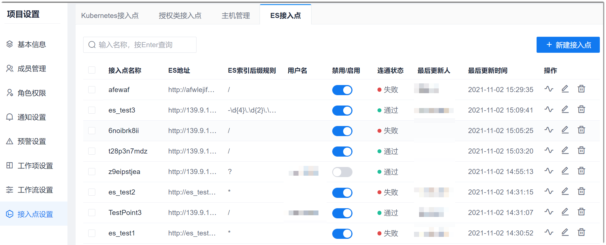
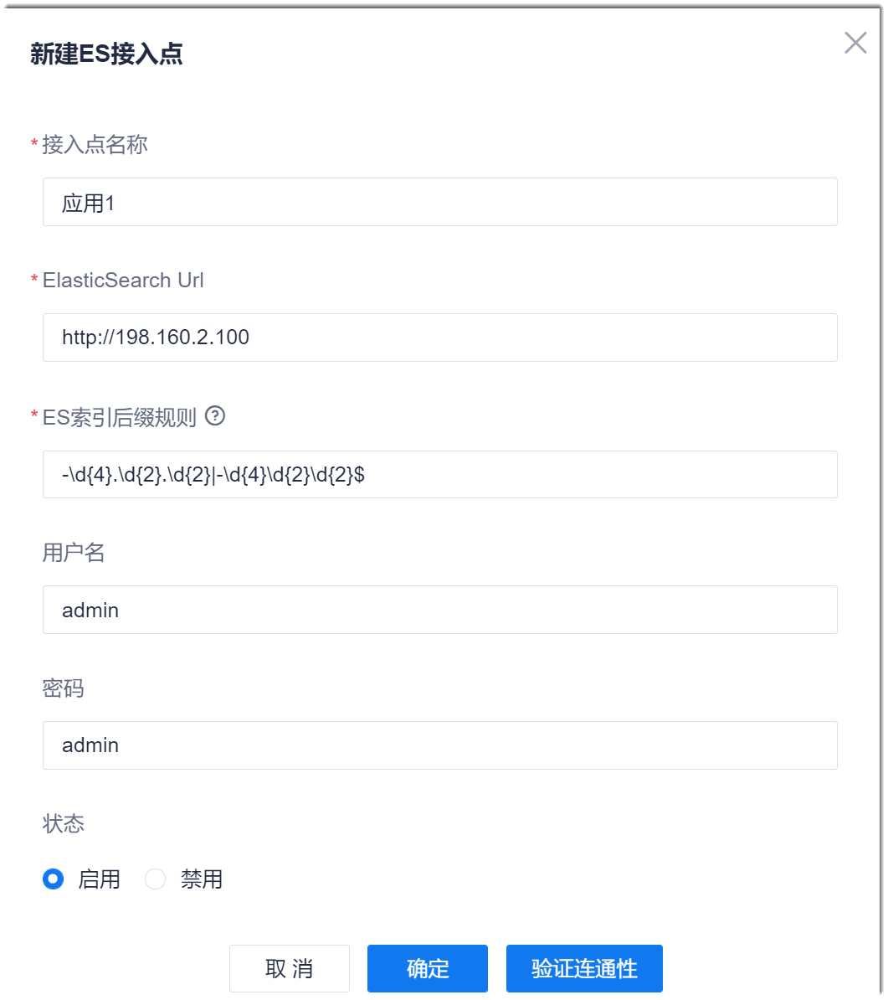

# 添加ES接入点

### 前提条件
* 已获取Elasticsearch（ES）的URL、索引后缀格式和用户名密码。

### 操作步骤
1. 在项目顶部菜单栏中，单击“项目设置”。
2. 在左侧导航栏中，单击“接入点设置”。       
2. 在右侧页面中，单击“ES接入点”页签。            
  进入ES接入点列表页面。              
          
3. 在右上角单击“新建接入点”。         
4. 在弹出的“新建ES接入点”对话框中，根据下表的描述，填写ES的信息，单击“验证连通性”。          
  
  
  <table>
<tr>
    <th>参数</th>
    <th>说明</th>
</tr>
<tr>
    <td>接入点名称 </td>
    <td>自定义接入点名称，仅支持中文、字母、数字、“_”、“-”字符，最多支持64个字符。</td>
</tr>
<tr>
    <td>ElasticSearch Url </td>
    <td>表示可以访问的ElasticSearch的URL地址。</td>
</tr>
<tr>
    <td>ES索引后缀规则</td>
    <td>表示需要匹配的ES索引的后缀规则，采用正则表达式格式。ES索引的后缀为一串数字（一般表示日期）。表达式的格式为：-\d{<i>数字的位数</i>}<i>字符</i>\d{<i>另一段数字的位数</i>}$。
如果需要匹配多种格式的后缀，则**在格式中间加“|”字符**：-\d{<i>数字的位数</i>}<i>数字间的分隔符</i>\d{<i>另一段数字的位数</i>}|\d{数字的位数</i>}<i>数字间的分隔符</i>\d{<i>另一段数字的位数</i>}$。

    
例如，需要匹配“20200101”和“2020.01.01”两种格式的后缀，本参数设置为：-\d{8}|\d{4}.\d{2}.\d{2}，或者-\d{4}\d{2}\d{2}|\d{4}.\d{2}.\d{2}。
</td>
</tr>
<tr>
    <td>用户名</td>
    <td>访问ES的用户名。</td>
</tr>
<tr>
    <td>密码</td>
    <td>“用户名”的密码。</td>
</tr>
<tr>
    <td>状态</td>
    <td>启用：该接入点可以在流水线的对应步骤中被发现。
禁用：该接入点不能在流水线的对应步骤中被发现。
</td>
</tr>
</table>

5. （可选）如果连通性验证失败，请检查并修改接入点信息，确保接入点可与系统互联互通。
6. 接入点信息配置完成后，单击“确定”。         
  页面返回列表，可以查看刚刚添加的ES接入点。
