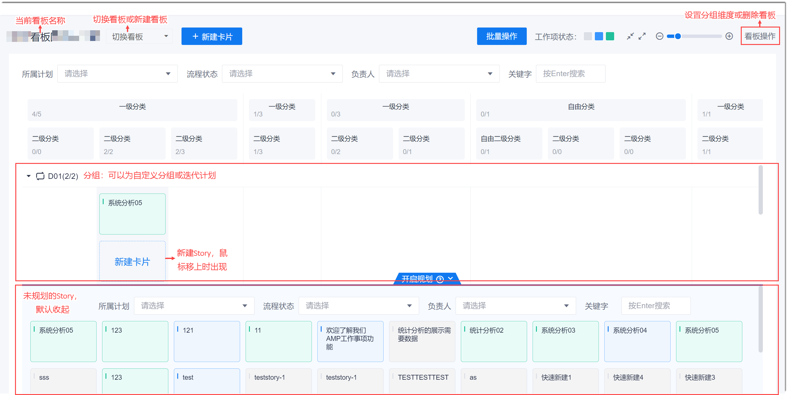

# 通过用户故事地图规划和分解需求

随着敏捷软件开发运动的兴起与发展，大家在管理需求时，都采用将需求拆分成用户故事的方式。用户故事可以使软件开发的过程实现一定程度的可视化，并实现价值（功能特性）的更快流动。但采用常规的用户故事管理方式，也会带来如下困境：
* 容易丢失软件系统全景图，“只见树木，不见森林”。
* 开发大型产品时，逐个开发小特性，团队会不知道整个产品何时能完成和发布。
* 用户故事从用户角度描述，团队认为非功能性需求没有用户，因此用户故事不适用。

用户故事地图是采用讲故事的方式，将产品使用过程中的用户体验图形化和可视化的一种方法，能在需求拆分过程中保持产品和用户体验的全景图。全景图可以帮助团队和用户有效地沟通，帮助团队避免开发非必要的特性，也为一致的用户体验提供了基准。

用户故事地图可以使我们专注于用户和用户体验，产生更好的沟通效果，最终做出更好的产品。使用用户故事地图可以带来如下收益：
* 提前识别产品创意中有哪些坑。
* 聚焦于故事的整体，不过早陷入细节。
* 帮助组织建立共识。
* 帮助规划发布路线图。

在使用用户故事地图分解需求时，就是在讲大故事的同时将需求拆分成小的用户故事（Story）。将小的用户故事（Story)串联成大的故事（活动）或更大的故事（角色或场景），讲述用户在使用产品中的故事和体验。         
系统的用户故事地图页面如下图所示。

