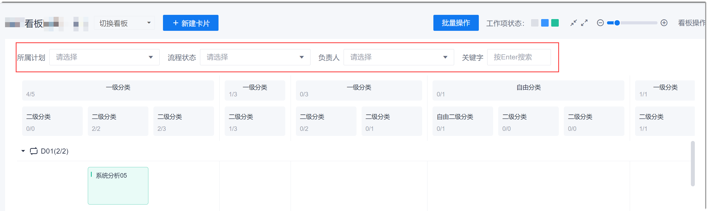
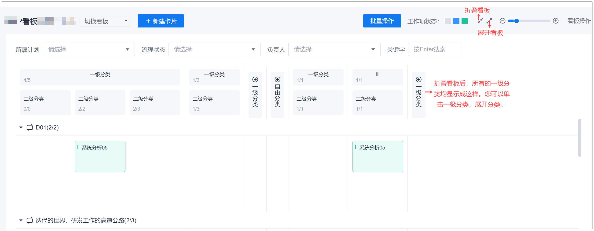
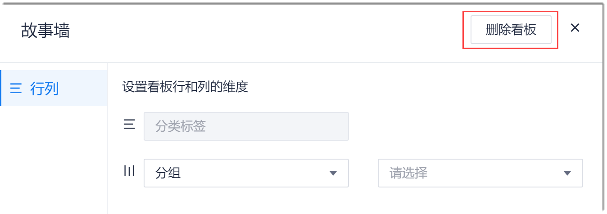
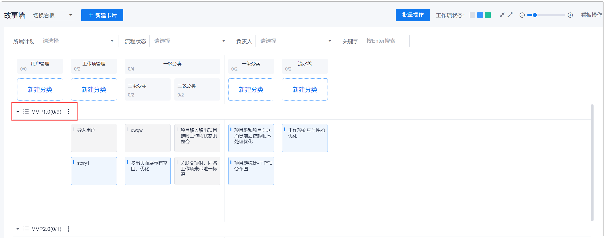
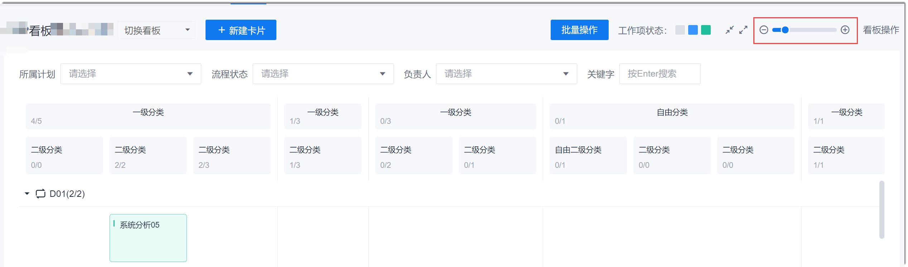

# 故事地图看板相关操作

通过故事地图完成需求规划后，您可以在日常工作中，通过看板查看进展。

### 切换看板
在故事地图界面左上方的“切换看板”下拉框中，选择看板名称。

### 搜索/筛选故事             
在看板上方，选择筛选条件或输入Story标题关键字，筛选或搜索Story。

### 折叠/展开看板              
当看板的一级分类太多，导致看板信息太多，干扰查看目标内容时，您可以折叠看板，然后展开目标分类，只查看目标内容。
1. 在看板上方的工具栏中，单击，折叠看板；单击，展开被折叠的看板。                    
  
  
2. 单击需要查看的一级分类，展开该分类，已查看下面的二级分类和故事。

### 删除看板
1. 在看板界面右上角，单击“看板操作”。
2. 在弹出的对话框中，单击“删除看板”。                    
                        
3. 在弹出的确认对话框中，单击“确定”。

### 切换横向分组维度                    
横向分组维度即下图红框的分组维度。     
          
1. 在看板界面右上角，单击“看板操作”。
2. 在弹出的对话框中，设置横向分组的维度，并进行分组筛选。                     
                       
3. 设置完成后，关闭对话框，设置自动生效。

### 放大/缩小看板
在看板上方的工具栏中，单击，放大看板；单击，缩小看板。
 
