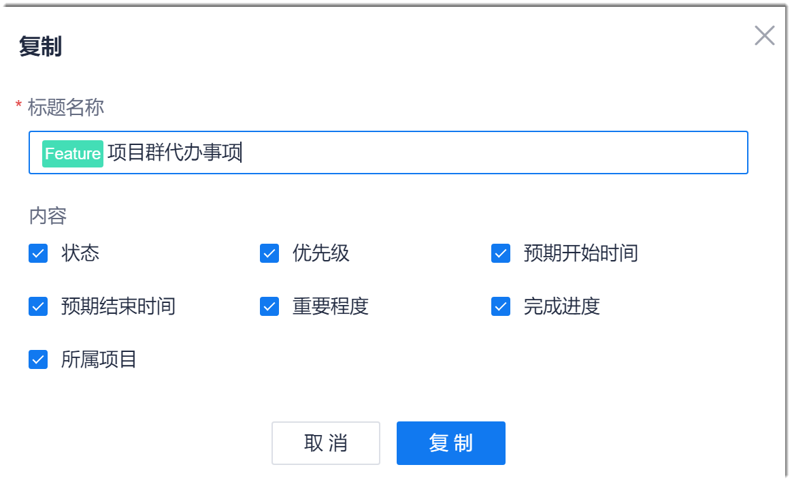

# 复制工作项

如果要新建的工作项信息与已存在的工作项信息差别不大，您可以通过复制的方式创建工作项，减少填写工作量，提升创建效率。

### 前提条件
* 已使用具有项目“新增工作项”权限的账号登录系统。

### 背景信息

复制工作项时，除系统自维护字段，以及实际工时、附件、评论、关联、详细工时、操作记录外，其它字段取值均继承被复制工作项的取值。

### 操作步骤
1. 选择任一方式进入“复制”对话框：
  * 在工作项列表中，单击待复制工作项“操作”列的“ > 复制”。
  * 在工作项详情页面中，单击右上角的“ > 复制”。
2. 在“复制”对话框中，设置工作项的标题，并选择需要复制取值的字段，单击“复制”。      
    对话框中显示的字段为源工作项中需要用户填写且有取值的字段。          
                     
    页面返回工作项列表。
    
3. 单击复制的工作项，打开工作项详情页面。
4. 单击工作项详情页面右上角的，修改工作项内容，然后单击“保存”。
