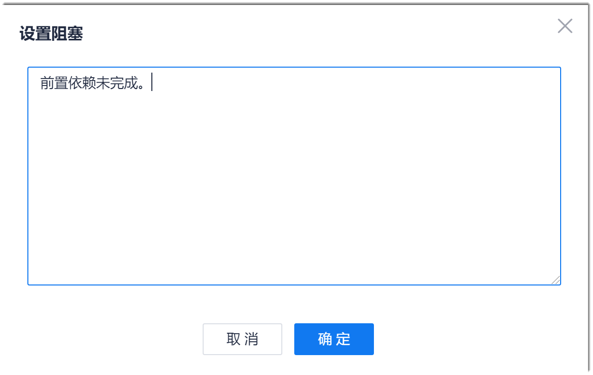
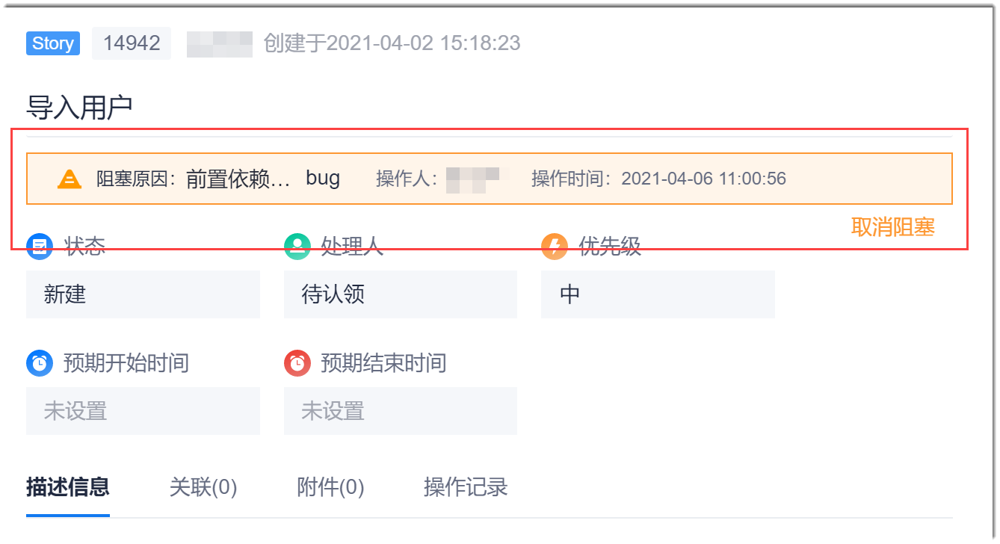
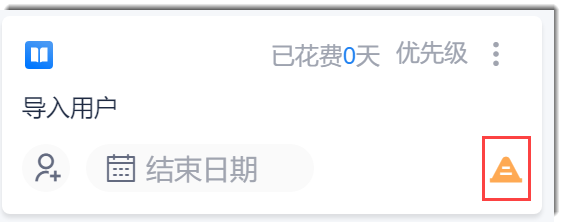
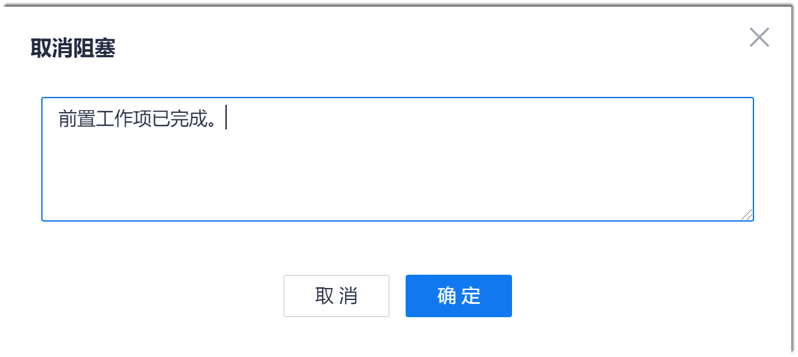
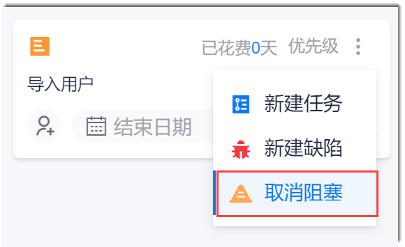

# 设置/解除工作项阻塞

为了使工作可视化，当工作项的实现有阻塞时，您可以设置阻塞；当工作项的阻塞解除时，您可以解除阻塞，使团队成员能了解当前工作情况，快速解决阻塞。

### 前提条件
* 已使用项目具有“修改工作项”权限的账号登录系统。

### 背景信息
工作项被设置阻塞后，工作项的状态不能被修改。由于工作项的数据在项目群、工作事项、故事地图、迭代冲刺中是拉通的，因此，工作项通过任一入口设置为阻塞后，在其它服务中，该工作项的状态也不能被修改。

### 操作入口
设置/解除工作项阻塞通过工作项详情界面操作，可以通过如下几个入口打开工作项详情：
* 故事地图（仅限于Story类型）：双击Story卡片，进入工作项详情界面。
* 工作事项：在项目顶部菜单栏中，单击“工作事项”。然后单击工作项。
* 迭代冲刺（仅限于Story、Task、Bug类型）：在项目顶部菜单栏中，单击“迭代冲刺”。然后在左侧界面单击迭代，在右侧界面单击工作项。

### 设置阻塞
1. 在工作项详情页面的右上方，单击“ > 设置阻塞”。
2. 在“设置阻塞”对话框中，输入阻塞原因，单击“确定”。                  
                    
设置成功后，在工作项详情界面上方，会显示如下信息：            
                   
在迭代看板的工作项卡片中，会显示如下标记：               

### 取消阻塞            
* 在工作项详情界面中取消：
  1. 在设置了阻塞的工作项详情页面上方，单击“取消阻塞”；或者在迭代看板的工作项卡片中，单击“ > 取消阻塞”。
  2. 在“取消阻塞”对话框中，输入取消阻塞原因，单击“确定”。                 
    
     
* 在迭代看板的工作项卡片中取消：
  1. 在迭代看板中，单击工作项卡片右上方的“ > 取消阻塞”。                    
                      
  2. 在“取消阻塞”对话框中，输入取消阻塞原因，单击“确定”。

设置成功后，工作项详情页面上方和工作项卡片的阻塞提示消失。工作项可以正常设置状态。
  
