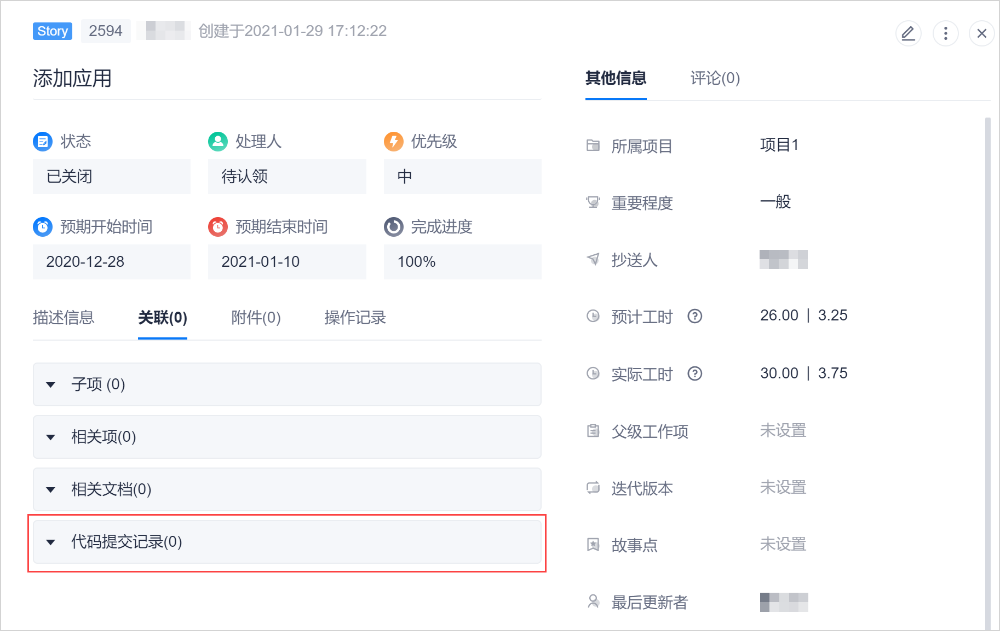

# 查看工作项的代码提交情况

如果在代码提交时备注了工作项的编号，则可以在工作项详情中查看与该工作项相关的代码提交情况。所有工作项类型均支持查看工作项的代码提交情况。

### 前提条件
* 在代码提交时，备注了工作项编号，参见[开发并提交代码](9.6-develop-commit-code.md)。
* CAP系统包含“项目 > 代码库”服务。
* 登录账号具有代码库的“在线浏览代码”权限。
  如果登录账号不具备代码库的“在线浏览代码”权限，则只能在工作项详情中查看到代码提交记录列表，不能点击记录查看提交详情。

### 背景信息                    
如果您的CAP系统不包含“项目 > 代码库”服务，则在工作项详情中不会显示“关联 > 代码提交记录”。            
                  

### 操作步骤        
1. 在工作项详情页面中，单击“关联 > 代码提交记录”。        
      如果有过该工作项的提交记录，则会显示提交记录。     
                  
2. 单击提交记录的提交号，可以查看该提交的详情。        
                        
3. 如果您具有代码库的“在线浏览代码”权限，则可以单击文件名称，查看本次变更的内容。                       
                             

