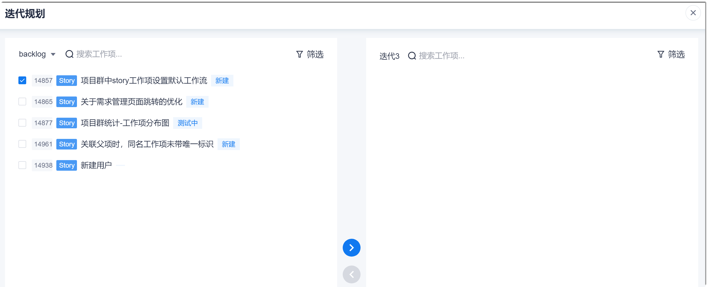
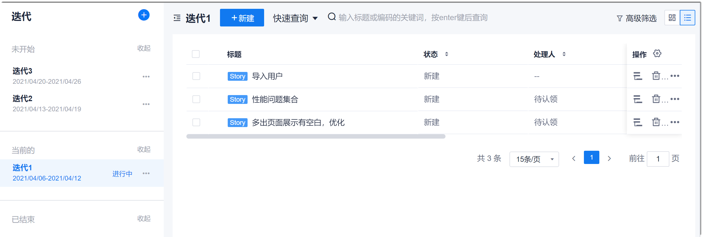
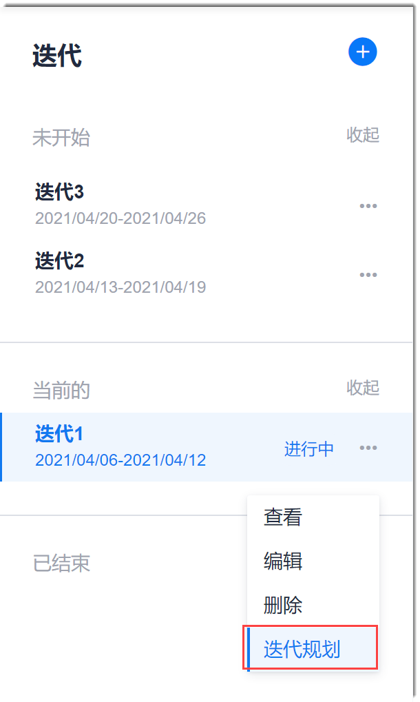
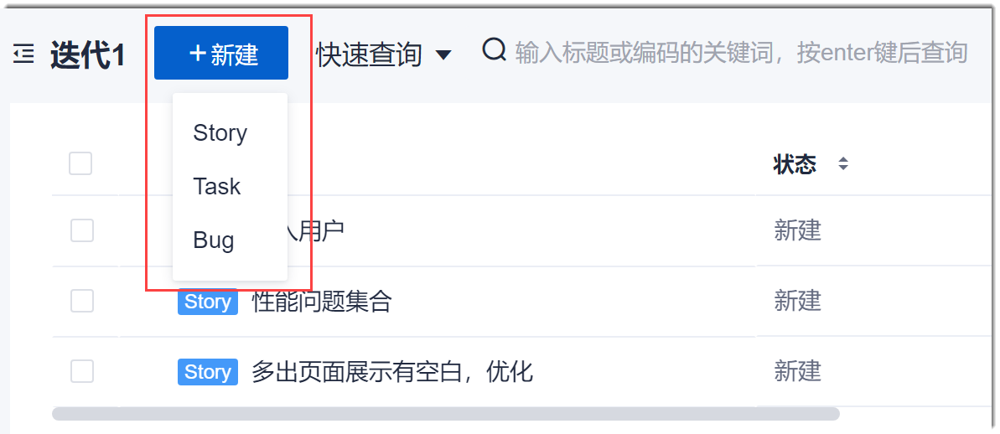

# 规划迭代内容

在创建迭代后，需要规划迭代的工作项范围（包括Story、Task、Bug类型的工作项），迭代的目标。

### 前提条件
* 已使用具有项目“修改工作项”权限的账号登录系统。
* 至少已完成Feature级别的需求分解。

### 操作步骤
1. 在项目顶部导航栏中，单击“迭代冲刺”，进入迭代冲刺管理界面。
2. 在左侧迭代列表中，单击需要规划的迭代。
3. 规划迭代内容。              
      规划迭代内容可以直接将已有工作项（包括未规划迭代或其它迭代的工作项）添加到本迭代中，也可以在迭代中创建工作事项。       
> [!NOTE]
> 将已有工作项添加到迭代中时，只能选择Story类型的工作项。选择Stroy类型的工作项时，当前已经挂接在该Story的子工作项会一并纳入迭代中。但后续新增的子项如果没有填迭代信息，则不会纳入之前规划的迭代中。因此，建议：1）所有的Task、Bug挂接到Story中。如果不挂接，则在迭代冲刺中创建Task、Bug。2）Story纳入迭代规划后，通过“工作事项”功能创建的Task、Bug需通过填写“迭代版本”规划迭代。
      
    在左侧页面中选择迭代后，规划该迭代的内容范围。规划迭代内容的操作步骤与迭代是新建的迭代还是已有的迭代有关。
    
  * 规划新建迭代的内容。          
    新建迭代的页面如下图所示。          
                 
    * 添加已有工作项
      1. 在右侧界面中单击“迭代规划”。              
        显示“迭代规划”对话框。左侧区域显示待规划的工作事项，可以是未规划迭代的，也可以是已规划到其它迭代的。您可以单击左上角的下拉按钮切换迭代。                     
                  
      2. 在左侧区域中选中需要纳入迭代的工作项，单击。
      3. 选择完成后，单击右上角的，关闭对话框。设置自动保存。
    * 新建工作项
      1. 在右侧界面中单击“创建工作项 > _工作项类型_”，打开“新建工作项”对话框。
      2. 根据[在线创建工作项](7.3.2.1-create-backlog-online.md)中的描述，填写相关信息，单击“确定”。
  * 规划已有迭代的内容。          
    已有迭代的界面如下图所示。         
    
    * 添加已有工作项
      1. 在左侧迭代列表中，单击迭代名称后面的“ > 迭代规划”。               
                        
         显示“迭代规划”对话框。左侧区域显示待规划的工作事项，可以是未规划迭代的，也可以是已规划到其它迭代的；右侧区域显示迭代中已有的工作项。              
      2. 将工作项加入迭代中：在左侧区域中选中需要纳入迭代的工作项，单击；将工作项移出迭代：在右侧区域中选中需要移出迭代的工作项，单击。      
        左侧区域显示待规划的工作事项，可以是未规划迭代的，也可以是已规划到其它迭代的。您可以单击左上角的下拉按钮切换迭代。      
      3. 选择完成后，单击右上角的，关闭对话框。设置自动保存。
    * 新建工作项
      1. 在迭代待办列表中，单击左上方“新建 > 工作项类型”。
        
        
      2. 根据[在线创建工作项](7.3.2.1-create-backlog-online.md)中的描述，填写相关信息，单击“确定”。

> [!TIP]
> 在迭代规划界面中，如果待选工作项比较多，您可以在查询框中输入关键字搜索或者通过筛选条件筛选，快速找到工作项。

