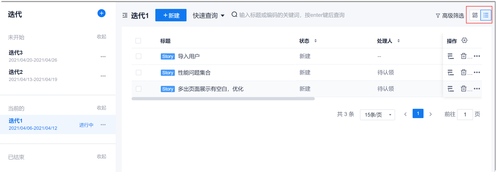

# 管理迭代工作项

迭代工作项有两种显示方式：
* **列表显示 **               
  在迭代冲刺首页面中，单击右上角的，显示迭代待办事项列表。
  
* **看板显示**                    
  在迭代冲刺首页面中，单击右上角的，显示迭代待办事项列表。                    
  其中，看板又分为故事板（只显示Story）和任务板（显示Task和Bug）。

