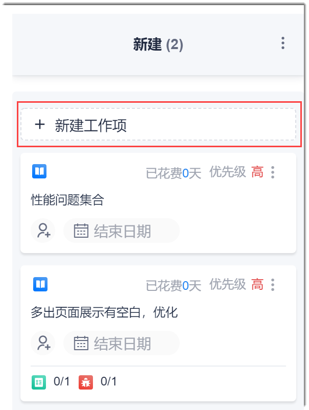
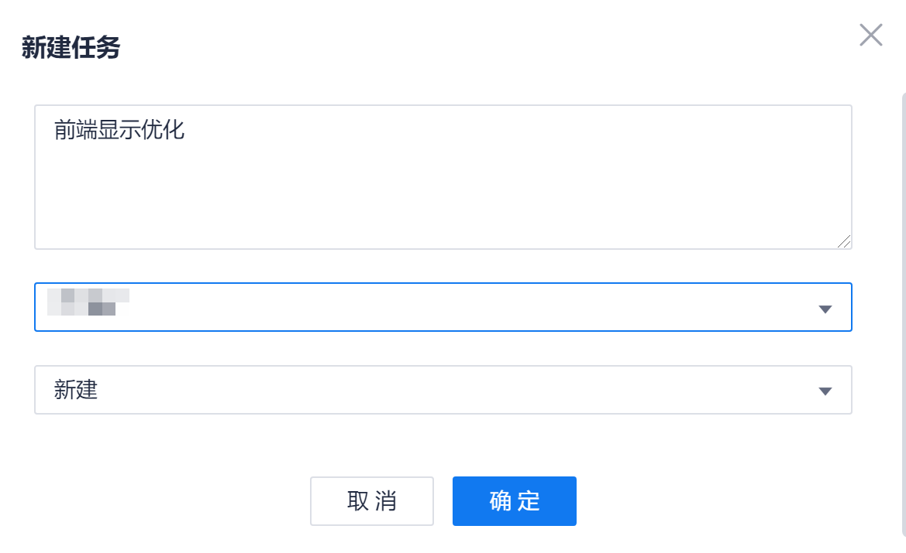
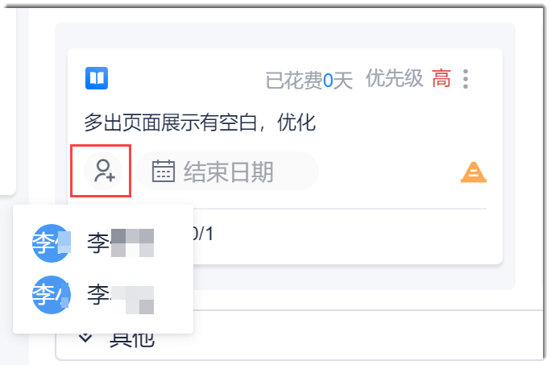
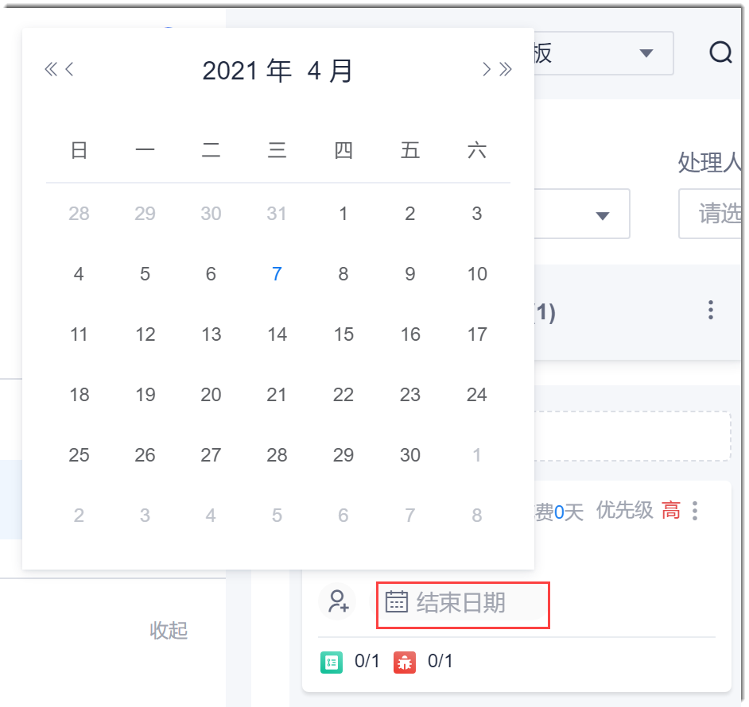
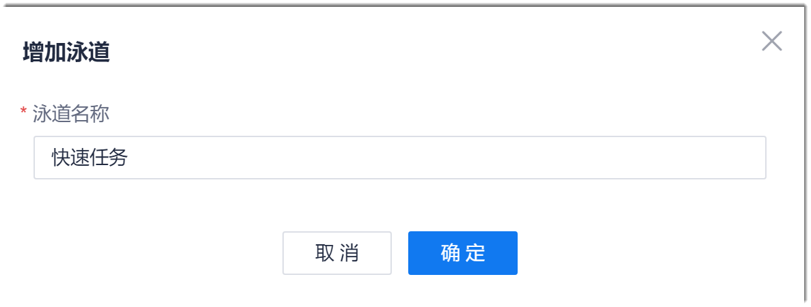
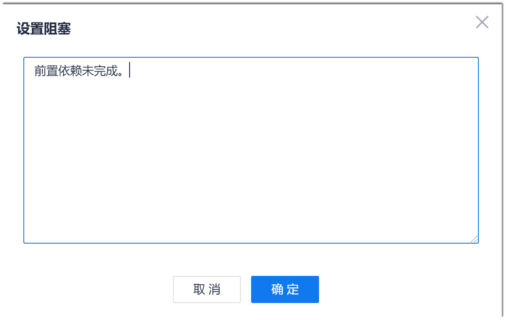
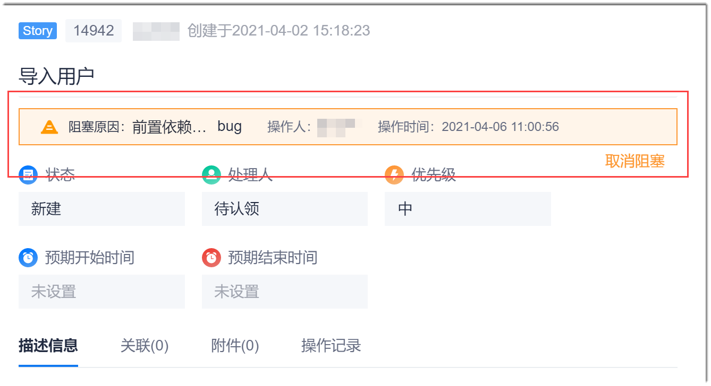
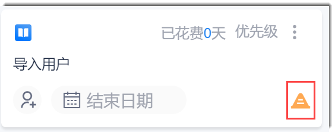

# 通过故事板管理工作项

您可以在故事板中创建Story、Task、Bug类型的工作项，修改工作项，删除工作项，快速设置处理人和结束日期，管理泳道，流转工作项，以及设置/解除工作项阻塞。

### 前提条件
 * 已使用具有项目“迭代与规划”、“工作项”相关权限的账号登录系统。

### 背景信息
迭代故事看板的界面如下所示：

### 管理工作项

#### 创建工作项
在故事板中，您可以创建Story、Task、Bug类型的工作项。
* 创建Story工作项。                       
    在故事板中，单击“新建”状态下面的“新建工作项”。根据实际情况填写相关参数，单击“确定”。
    
    
    
* 创建Task、Bug工作项。
   
   在故事板的Story卡片右上角，单击“ > 新建任务/新建缺陷”。然后在弹出的“新建任务/新建缺陷”对话框中，设置相应参数，单击“确定”。     
  
   
   Task、Bug工作项创建成功后，在故事板中不可见，需切换到任务板或列表视图查看。
   
#### 修改/删除Story工作项信息
1. 在故事板中，单击Story卡片中的工作项名称，进入工作项详情界面。
2. 执行相关操作：
  * 单击右上角的 ：修改工作项。
  * 单击右上角的“ > 删除”：删除工作项。
> [!NOTE]
> 在工作项详情中可以执行的操作，还包括：复制、设置阻塞、解除阻塞、关联内容。

#### 修改/删除Task/Bug工作项
1. 在故事板中，单击Story卡片中Task标记或Bug标记，然后选择需要删除的。
2. 执行相关操作：
  * 单击右上角的 ：修改工作项。
  * 单击右上角的“ > 删除”：删除工作项。
> [!NOTE]
> 在工作项详情中可以执行的操作，还包括：复制、设置阻塞、解除阻塞、关联内容。

#### 快捷设置Story处理人
在故事板中，单击Story卡片中的（未设置责任人）或处理人图标（已设置责任人），然后选择新的责任人。

#### 快捷设置Story结束时间
在故事板中，单击Story卡片中的“结束日期”，然后选择结束日期。

### 管理泳道

您可以对进行态的Story使用泳道进行分类。

当项目的工作项需要按照关注的维度分门别类时，您可以创建泳道，用于分类管理工作项。例如，创建“快速任务”泳道，用于归类2天内需要完成的Story。或者创建专属于某个团队的泳道。

没有自定义泳道时，所有进行态的Story不区分泳道。当创建了泳道后，未纳入自定义泳道的Story默认归类到“其他”泳道中。

#### 创建泳道
1. 在故事板的进行态下面单击“增加泳道”。
2. 在“增加泳道”对话框中，输入泳道名称，单击“确定”。
  
  
  
创建成功后，故事板界面按照创建时间倒序显示新增的泳道。默认为展开状态。同时，系统自动创建一个名为“其他”的泳道，用于归类不在自定义泳道内的Story。
    
#### 将Story移入/移出泳道

当Story设置阻塞后，Story不能移入或移出泳道。

展开泳道，然后将需要移入的Story卡片拖入泳道中，将泳道中的Story卡片拖入需要的位置。

#### 修改/删除泳道
    
* 修改泳道名称：单击泳道最右侧的“ > 修改名称”。然后在“修改名称”对话框中，输入新名称，单击“确定”。
* 删除泳道：单击泳道最右侧的“ > 删除泳道”。
    
    当泳道中没有Story时，才能删除泳道。
    
### 流转工作项

Story卡片可以在设置了流转的状态之间相互移动。如何设置状态流转请参见上一节：“自定义工作流”。

当Story设置阻塞后，Story不能流转。

在故事板中，拖动未设置阻塞的工作项卡片到需要的状态下，即可将工作项流转到该状态。该工作项详情的“状态”字段取值会随之改变。

### 设置/解除工作项阻塞
* 设置阻塞
  1. 在故事板中，单击工作项卡片右上方的“ > 设置阻塞”。
  2. 在弹出的“设置阻塞”对话框中，输入阻塞原因，单击“确定”。
  
  
  
  设置成功后， 在工作项详情会显示阻塞信息，在工作项卡片上会显示。
  
  
  
  
  
  设置了阻塞的工作项不能修改其状态，因此，不能拖动该工作项卡片。
  
* 解除阻塞
  1. 在故事板中，单击已设置阻塞的工作项卡片右上方的“ > 解除阻塞”。
  2. 在弹出的“解除阻塞”对话框中，输入解除原因，单击“确定”。
  
  解除成功后，阻塞提示或标志会消失。同时，可以修改工作项的状态。
    